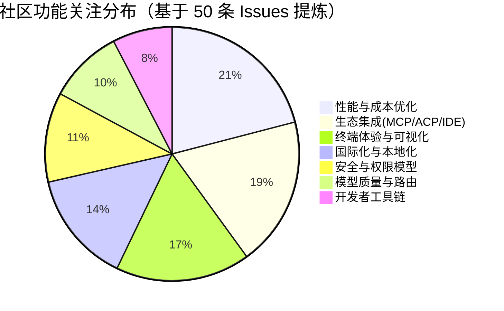

# AI CLI 工具社区动态日报 2026-05-13

> 生成时间: 2026-05-13 00:24 UTC | 覆盖工具: 9 个

- [Claude Code](https://github.com/anthropics/claude-code)
- [OpenAI Codex](https://github.com/openai/codex)
- [Gemini CLI](https://github.com/google-gemini/gemini-cli)
- [GitHub Copilot CLI](https://github.com/github/copilot-cli)
- [Kimi Code CLI](https://github.com/MoonshotAI/kimi-cli)
- [OpenCode](https://github.com/anomalyco/opencode)
- [Pi](https://github.com/badlogic/pi-mono)
- [Qwen Code](https://github.com/QwenLM/qwen-code)
- [DeepSeek TUI](https://github.com/Hmbown/DeepSeek-TUI)
- [Claude Code Skills](https://github.com/anthropics/skills)

---

## 横向对比

# AI CLI 工具生态横向对比分析报告 | 2026-05-13

---

## 1. 生态全景

当前 AI CLI 工具生态呈现**"头部三强（Claude Code / Codex / Gemini CLI）领跑基础设施，垂直工具（Kimi / Qwen / DeepSeek）追赶差异化，开源替代（OpenCode / Pi）探索架构创新"**的格局。核心竞争已从"能否运行"转向**终端工程深度**（渲染稳定性、复制格式、键位映射）、**企业级可靠性**（MCP 连接池、权限持久化、原子写入）与**成本透明度**（token 计量、缓存命中、配额路由）的三维较量。Rust/Effect 等系统语言重构底层、Daemon 化架构转型、以及 MCP/ACP 协议生态的工业化就绪，成为贯穿全行业的技术主线。

---

## 2. 各工具活跃度对比

| 工具 | Issues（24h 更新） | PRs（24h 更新） | Release 动态 | 活跃度评级 |
|:---|:---|:---|:---|:---|
| **Claude Code** | ~10 条重点跟踪 | 3 条活跃（文档主导） | v2.1.140（Agent 匹配修复、/goal 挂起修复） | ⭐⭐⭐⭐☆ 稳定维护期 |
| **OpenAI Codex** | 高（#14593 单条 575 评论） | 10 条密集（权限架构重构） | Rust CLI α.7→α.9 三连发 | ⭐⭐⭐⭐⭐ **最高活跃** |
| **Gemini CLI** | ~10 条（429 路由新增） | 10 条（Auto 模式合并、安全修复） | v0.43.0-preview.0 + v0.42.0 双版本 | ⭐⭐⭐⭐⭐ 快速迭代期 |
| **GitHub Copilot CLI** | 32 条 | **0 条**（紧急热修复模式） | v1.0.46（PowerShell 紧急修复） | ⭐⭐⭐☆☆ 事件驱动响应 |
| **Kimi Code CLI** | 10 条 | 10 条（社区贡献活跃） | v1.43.0（UI/遥测优化） | ⭐⭐⭐⭐☆ 稳步上升 |
| **OpenCode** | **50 条** | **50 条**（kitlangton 测试迁移潮） | 无新发布，1.14.48 输入回归待修 | ⭐⭐⭐⭐⭐ **Issue/PR 总量最高** |
| **Pi** | ~10 条（批量关闭重构旧 Issue） | 8 条（7 关闭 1 开放） | 无 | ⭐⭐⭐☆☆ 重构收尾期 |
| **Qwen Code** | 37 条 | **50 条** | v0.15.11-preview.x 双发 | ⭐⭐⭐⭐⭐ 工程爆发期 |
| **DeepSeek TUI** | ~15 条 | 10 条（闪烁修复密集） | v0.8.32（引入闪烁回归） | ⭐⭐⭐⭐☆ 质量攻坚期 |

> **关键洞察**：Codex、Gemini CLI、OpenCode、Qwen Code 构成今日"四高"阵营（高 Issues + 高 PR + 高频发布），反映基础设施层竞争白热化；Copilot CLI 的 0 PR 与紧急热修复模式暴露其发布流程的封闭性风险。

---

## 3. 共同关注的功能方向

| 功能方向 | 涉及工具 | 具体诉求与证据 |
|:---|:---|:---|
| **🖥️ 终端/TUI 工程深度** | Claude Code #18170（107 评论）、OpenCode #16100/#27096、DeepSeek TUI #1378/#1515、Qwen Code #3838 | **复制格式污染**（多余缩进/空格）、**键位映射回归**（Dvorak/数字小键盘）、**渲染闪烁**（resize/流式输出）、**终端假死**（shell 等待输入）——跨平台终端一致性成为"声量之王" |
| **💰 成本透明度与配额治理** | Codex #14593（575 评论）、Gemini CLI #26862/#26619、DeepSeek TUI #1177、Kimi #1925 | **Token 消耗黑箱**（无实时计量、异常耗用）、**429 智能降级**（死循环重试 vs 自动路由）、**配额幽灵消耗**（模型锁定不生效）、**缓存命中率可观测** |
| **🔌 MCP/ACP 生态工业化** | Claude Code #10071/#10265、Codex #17444/#21624/#22399、Gemini CLI #26954、Copilot CLI #3257、DeepSeek TUI #1092/#1488、Qwen Code #3994 | **连接可靠性**（空闲断连、无自动重连）、**协议安全**（MCPSafe Grade F→修复）、**会话保持**（mcp-session-id）、**工具暴露完整性**（ACP 适配器） |
| **🔐 权限与自动化平衡** | Claude Code #53728、Codex #22327（线程级权限重构）、OpenCode #8463（47 👍 YOLO 模式）、Kimi #2249（权限模式统一）、Qwen Code #4016 | **CI/CD 无人值守**（全局绕过标志）、**权限持久化**（跨会话保存）、**多认证源冲突**（API Key 静默覆盖订阅）、**企业 Hook 策略** |
| **🧠 Agent 自主性与可靠性** | Gemini CLI #21968/#22323、Claude Code #10238（Skills 子目录）、Codex #21343（上下文压缩崩溃）、Qwen Code #4055/#3730（自循环/自动停止）、Pi #4290（长度超限误判） | **技能发现机制**（配置后不被调用）、**状态机语义正确性**（成功 vs 中断 vs 截断）、**长任务稳定性**（>1 周运行）、**上下文可靠性**（压缩后崩溃） |
| **🔄 会话生命周期管理** | Copilot CLI #2058（/fork 8 评论）、OpenCode #27163（原生 /goal）、Kimi #2218（对标 Codex /goal）、Codex #12098（标签页并行） | **分叉/暂停/恢复**（Git 式分支语义）、**跨端同步**（CLI/Desktop 历史）、**长时间运行**（token 刷新不中断） |

---

## 4. 差异化定位分析

| 工具 | 核心功能侧重 | 目标用户画像 | 技术路线特征 |
|:---|:---|:---|:---|
| **Claude Code** | **Agent 工具编排 + Skills 生态** | 企业团队、复杂代码库维护者 | TypeScript 全栈，Anthropic 模型深度绑定；Agent 配色、subagent_type 匹配等细节打磨；文档缺口由社区系统性填补 |
| **OpenAI Codex** | **权限安全架构 + 企业合规** | 大型组织、安全敏感场景 | **Rust 核心引擎**重构中，线程级权限模型（#22327）为行业最深；插件市场商业化基础设施（#22397）；IDE 扩展与 CLI 双轨并行 |
| **Gemini CLI** | **智能路由 + 记忆系统** | Google 生态用户、多模型按需切换场景 | **Auto 模式合并**（复杂度动态路由）、JIT context + memory 功能上线后清理技术债务；MCP 安全加固（MCPSafe Grade F→修复） |
| **GitHub Copilot CLI** | **GitHub 原生集成 + 会话即代码** | GitHub 重度用户、现有 Copilot 订阅者 | 闭源开发，与 gh CLI 深度整合；`/fork` 会话分叉理念前卫但实现粗糙；发布流程透明度受质疑 |
| **Kimi Code CLI** | **OpenAI 兼容 + 模型版本选择** | 中国开发者、寻求国产替代的企业 | 积极拥抱 OpenAI API 兼容（#2208/#1947）以打破生态隔离；K2.5/K2.6 模型迭代引发"能力升级≠体验升级"争议 |
| **OpenCode** | **多 Provider 治理 + Effect 架构** | 高级开发者、多模型/多账户管理需求 | **Effect 函数式架构**独树一帜（kitlangton 主导测试迁移）；OpenRouter 多实例、Provider 固定等企业级配置能力领先；v2 模型列表 API 程序化发现 |
| **Pi** | **本地 LLM 生态 + 多云适配** | 隐私优先用户、本地模型部署者 | **Bun 运行时**；llama.cpp/ollama/LM Studio 原生支持呼声最高（23 👍）；供应链安全响应迅速（shrinkwrap） |
| **Qwen Code** | **Daemon 化 + 企业安全合规** | 中国政企市场、需要国产化方案的组织 | **qwen serve HTTP 守护进程**（#3889）架构跃迁；AES-256-GCM 加密存储、原子文件写入、分层遥测追踪——**企业级安全基线最完整** |
| **DeepSeek TUI** | **前缀缓存优化 + 终端性能** | 成本极度敏感用户、DeepSeek API 重度使用者 | **prefix-cache 稳定性追踪**（#1517）对标 Reasonix 95%+ 命中率；chunk 并行安全工具执行（#1535）；主题系统（Catppuccin/Tokyo Night）可定制性 |

---

## 5. 社区热度与成熟度

### 🔥 社区活跃度梯队

| 梯队 | 工具 | 判定依据 |
|:---|:---|:---|
| **第一梯队：工程爆发期** | **Codex、Gemini CLI、OpenCode、Qwen Code** | 日均 50+ 代码变更、架构级重构进行中、社区贡献者多元（非单一维护者） |
| **第二梯队：稳步迭代期** | **Claude Code、Kimi、DeepSeek TUI** | 版本节奏稳定（2-4 周）、Issue 响应及时、特定领域深度打磨 |
| **第三梯队：重构/调整期** | **Pi、Copilot CLI** | Pi 处于"Big Refactor"后清理阶段；Copilot CLI 封闭开发导致社区参与渠道狭窄 |

### 📊 成熟度指标交叉分析

| 维度 | 最成熟 | 最不成熟 | 说明 |
|:---|:---|:---|:---|
| **终端工程** | Claude Code（细节打磨深） | DeepSeek TUI（v0.8.32 引入闪烁回归） | 复制格式、键位映射、resize 稳定性 |
| **企业安全** | Qwen Code（加密+原子写入+追踪） | Pi（shrinkwrap 刚提议） | 数据完整性、供应链安全、审计合规 |
| **生态开放性** | OpenCode（多 Provider + v2 API） | Kimi（OpenAI 兼容仍在追赶） | 模型发现、第三方集成、配置互操作 |
| **成本透明度** | — | **全行业短板** | Codex #14593 575 评论、Gemini #26619 "幽灵配额"——无一家真正解决 |
| **文档完整性** | Claude Code（社区系统性填补后改善） | Copilot CLI（发布说明与实际不符 #3252） | 变更日志准确性、配置参考、迁移指南 |

---

## 6. 值得关注的趋势信号

### 🎯 对技术决策者的参考价值

| 趋势信号 | 证据来源 | 战略含义 |
|:---|:---|:---|
| **"终端复制格式"成为跨工具公敌** | Claude Code #18170（107 评论）、#37796；OpenCode #16100 | **TUI 工程已从"体验优化"升级为"生产力基础设施"**——评估 AI CLI 时，需将终端兼容性测试纳入 CI，而非仅功能验证 |
| **Rust/系统语言重构 CLI 核心** | Codex Rust CLI α 系列、Qwen Code 性能优化 | **Python/Node.js 运行时瓶颈显现**，长会话、高并发场景下内存安全与性能成为差异化壁垒；技术选型需关注底层运行时演进 |
| **Daemon 化 = 下一代架构分水岭** | Qwen Code #3803/#3889（qwen serve）、Codex 线程级权限服务端化 | CLI 工具正向"常驻服务"演进，支持远程调用、多客户端、Webhook 触发；**架构评估需纳入服务端部署模式** |
| **MCP 从"Demo 协议"到"生产债务"** | 全工具 MCP Issues 密集：Claude #10071、Codex #17444、Gemini #26954、Copilot #3257、DeepSeek #1488 | MCP 生态进入"工业化阵痛期"，连接池、会话保持、错误降级、安全基线成为硬门槛；**企业采购需验证 MCP 供应商的生产级承诺** |
| **"模型版本选择"反噬模型厂商** | Kimi #1925（K2.5 vs K2.6 激烈争议）、Gemini #26714（Auto 模式合并） | **用户开始拒绝"最新即最好"**，要求保留旧版本、透明切换、行为可预测；模型迭代策略需纳入用户体验考量 |
| **成本透明度 = 付费意愿闸门** | Codex #14593（575 评论，2 个月未解）、Gemini #26619（付费用户抗议）、DeepSeek #1177（缓存命中率对标） | **Token 经济黑箱正在摧毁付费信任**；产品需内置实时计量、命中率仪表盘、版本间成本 diff 工具 |
| **"会话即代码"重塑交互范式** | Copilot #2058（/fork）、OpenCode #27163（/goal）、Kimi #2218（对标 Codex） | 开发者将 AI CLI 视为**状态ful 协作环境**，需 Git 式分支、持久化、恢复语义；产品设计从"问答"转向"工作流编排" |

---

> **报告生成时间**：2026-05-13 | **数据来源**：各工具 GitHub 公开仓库 | **分析框架**：基于 400+ 条 Issues/PRs/Release 的交叉比对

---

## 各工具详细报告

<details>
<summary><strong>Claude Code</strong> — <a href="https://github.com/anthropics/claude-code">anthropics/claude-code</a></summary>

## Claude Code Skills 社区热点

> 数据来源: [anthropics/skills](https://github.com/anthropics/skills)

# Claude Code Skills 社区热点报告（截至 2026-05-13）

---

## 1. 热门 Skills 排行（按社区关注度）

| 排名 | Skill | 功能概述 | 状态 | 链接 |
|:---|:---|:---|:---|:---|
| 1 | **document-typography** | AI 生成文档的排版质量控制：防止孤行、寡行、编号错位等常见排版问题 | 🟡 Open | [PR #514](https://github.com/anthropics/skills/pull/514) |
| 2 | **testing-patterns** | 全栈测试技能集：测试哲学（Testing Trophy）、单元测试（AAA 模式）、React 组件测试、E2E 测试 | 🟡 Open | [PR #723](https://github.com/anthropics/skills/pull/723) |
| 3 | **odt** | OpenDocument 格式（.odt/.ods）的创建、模板填充、解析及转 HTML | 🟡 Open | [PR #486](https://github.com/anthropics/skills/pull/486) |
| 4 | **sensory** | 原生 macOS 自动化：通过 AppleScript/osascript 替代截图式 computer use，分级权限控制 | 🟡 Open | [PR #806](https://github.com/anthropics/skills/pull/806) |
| 5 | **AURELION suite** | 四件套认知框架：结构化思维模板（kernel）、专业顾问（advisor）、自主代理（agent）、持久记忆（memory） | 🟡 Open | [PR #444](https://github.com/anthropics/skills/pull/444) |
| 6 | **ServiceNow platform** | 企业级 ServiceNow 全平台助手：覆盖 ITSM/ITOM/ITAM/FSM/SPM/SecOps/IntegrationHub | 🟡 Open | [PR #568](https://github.com/anthropics/skills/pull/568) |
| 7 | **AppDeploy** | 全栈 Web 应用一键部署：直接通过 Claude 部署至公网 URL，支持生命周期管理 | 🟡 Open | [PR #360](https://github.com/anthropics/skills/pull/360) |
| 8 | **masonry-generate-image-and-videos** | AI 图像/视频生成：集成 Imagen 3.0、Veo 3.1，支持任务管理与下载 | 🟡 Open | [PR #335](https://github.com/anthropics/skills/pull/335) |

**讨论热点**：document-typography 切中 AI 生成文档的普遍痛点（"影响 Claude 生成的每一份文档"）；testing-patterns 填补全栈测试方法论空白；sensory 代表"原生自动化替代截图方案"的新范式。

---

## 2. 社区需求趋势（Issues 提炼）

| 方向 | 代表 Issue | 核心诉求 |
|:---|:---|:---|
| **组织级 Skill 共享** | [#228](https://github.com/anthropics/skills/issues/228)（11 评论, 7 👍） | 企业内直接共享 Skill 库，替代 Slack 传文件 + 手动上传的笨拙流程 |
| **Skill 触发可靠性** | [#556](https://github.com/anthropics/skills/issues/556)（8 评论, 6 👍） | `claude -p` 模式下 Skill 零触发率，急需评估/调试工具 |
| **MCP 协议互通** | [#16](https://github.com/anthropics/skills/issues/16) | 将 Skills 暴露为 MCP，实现算法化调用（`generateAlgorithmArt({...})`） |
| **安全信任边界** | [#492](https://github.com/anthropics/skills/issues/492)（6 评论, 2 👍） | 社区 Skill 冒用 `anthropic/` 命名空间，需防范权限滥用 |
| **插件去重与精准加载** | [#189](https://github.com/anthropics/skills/issues/189)（6 评论, 8 👍）, [#1087](https://github.com/anthropics/skills/issues/1087) | `document-skills` 与 `example-skills` 重复加载，插件应遵循 `marketplace.json` 声明 |
| **AWS Bedrock 兼容** | [#29](https://github.com/anthropics/skills/issues/29) | 非 Anthropic 官方渠道的模型接入需求 |
| **MCP 数据压缩优化** | [#1102](https://github.com/anthropics/skills/issues/1102) | 数据库类 MCP 返回过量数据导致上下文拥堵 |

---

## 3. 高潜力待合并 Skills

| Skill | 作者 | 关键价值 | 阻塞风险 | 链接 |
|:---|:---|:---|:---|:---|
| **document-typography** | PGTBoos | 通用性极强，影响所有文档输出质量；问题描述精准 | 需 Anthropic 审核排版规则与 Claude 生成管道的兼容性 | [PR #514](https://github.com/anthropics/skills/pull/514) |
| **testing-patterns** | 4444J99 | 测试领域方法论空白，覆盖从哲学到实践的完整链条 | 体量较大，可能需要拆分或精简 | [PR #723](https://github.com/anthropics/skills/pull/723) |
| **sensory** | AdelElo13 | AppleScript 自动化比截图方案更轻量、更精确；权限分级设计成熟 | macOS 独占，跨平台扩展性有限 | [PR #806](https://github.com/anthropics/skills/pull/806) |
| **odt** | GitHubNewbie0 | 开源文档标准（ISO）支持，与现有 docx/pdf skill 形成互补 | 需验证与 LibreOffice 生态的集成深度 | [PR #486](https://github.com/anthropics/skills/pull/486) |
| **skill-quality-analyzer** + **skill-security-analyzer** | eovidiu | 元技能（Meta Skill）：自动评估 Skill 质量与安全，生态自我完善 | 评估标准需与官方规范对齐 | [PR #83](https://github.com/anthropics/skills/pull/83) |
| **codebase-inventory-audit** | p19dixon | 技术债务治理：孤儿代码、未使用文件、文档缺口检测 | 10 步工作流可能过于繁重 | [PR #147](https://github.com/anthropics/skills/pull/147) |

> **注**：所有高潜力 PR 均为 **Open** 状态，无一条合并。社区贡献活跃但官方合并节奏保守。

---

## 4. Skills 生态洞察

> **核心矛盾**：社区在"Skill 生产端"爆发式创新（文档排版、测试方法论、企业平台集成、原生自动化），但"Skill 消费端"的基础设施严重滞后——组织共享、触发可靠性、插件去重、MCP 互通等分发机制尚未打通，导致高质量 Skill 难以规模化落地。

---

*报告基于 anthropics/skills 公开数据生成，PR/Issue 链接可直接访问获取最新状态。*

---

# Claude Code 社区动态日报 | 2026-05-13

---

## 今日速览

Anthropic 今日发布 v2.1.140 版本，重点修复了 Agent 工具匹配和 `/goal` 命令挂起问题。社区持续聚焦终端复制格式问题（#18170 评论破百）与文档完善，贡献者 coygeek 和 nawazxz 密集补齐了 10 余项文档缺口。

---

## 版本发布

### [v2.1.140](https://github.com/anthropics/claude-code/releases/tag/v2.1.140)

| 更新项 | 说明 |
|--------|------|
| Agent 工具 `subagent_type` 匹配增强 | 支持大小写和分隔符不敏感匹配，如 `"Code Reviewer"` 自动解析为 `code-reviewer` |
| Agent 配色方案更新 | 调整代理可视化颜色 |
| `/goal` 命令修复 | 解决 `disableAllHooks` 或 `allowManagedHooksOnly` 设置下命令静默挂起的问题，现会正常显示提示 |

---

## 社区热点 Issues

| # | 状态 | 标题 | 关键度 | 社区反应 | 链接 |
|---|:--:|------|--------|----------|------|
| 18170 | 🔴 OPEN | 终端复制包含多余缩进和尾部空格 | ⭐⭐⭐⭐⭐ | **107 评论，235 👍**，社区最痛点；影响代码粘贴效率，用户呼吁紧急修复 | [链接](https://github.com/anthropics/claude-code/issues/18170) |
| 10238 | 🔴 OPEN | Skills 支持子目录结构 | ⭐⭐⭐⭐⭐ | 36 评论，144 👍；大型团队技能管理刚需，长期悬而未决 | [链接](https://github.com/anthropics/claude-code/issues/10238) |
| 23347 | 🟢 CLOSED | `spinnerVerbs` 用户级设置被忽略 | ⭐⭐⭐⭐ | 26 评论，31 👍；今日关闭，个性化体验修复 | [链接](https://github.com/anthropics/claude-code/issues/23347) |
| 10071 | 🔴 OPEN | MCP 断线自动重连机制 | ⭐⭐⭐⭐ | 24 评论，37 👍；企业级 MCP 集成稳定性需求 | [链接](https://github.com/anthropics/claude-code/issues/10071) |
| 33502 | 🔴 OPEN | GUI 文件夹添加后支持从最近列表删除 | ⭐⭐⭐ | 15 评论，15 👍；UI 交互细节优化 | [链接](https://github.com/anthropics/claude-code/issues/33502) |
| 48694 | 🟢 CLOSED | Desktop 应用 PR 状态栏显示已关闭/合并的 PR | ⭐⭐⭐ | 9 评论，2 👍；回归 bug 修复 | [链接](https://github.com/anthropics/claude-code/issues/48694) |
| 10265 | 🔴 OPEN | 自动更新 Marketplace 插件能力 | ⭐⭐⭐⭐ | 9 评论，53 👍；企业安全合规场景关键需求 | [链接](https://github.com/anthropics/claude-code/issues/10265) |
| 37796 | 🔴 OPEN | 复制文本包含 2 空格前导缩进（macOS TUI） | ⭐⭐⭐⭐ | 5 评论，21 👍；#18170 的关联/重复问题，终端渲染层根因 | [链接](https://github.com/anthropics/claude-code/issues/37796) |
| 53728 | 🔴 OPEN | `ANTHROPIC_API_KEY` 静默覆盖 Max 订阅认证 | ⭐⭐⭐⭐ | 4 评论；多认证方式冲突，用户易误触成本陷阱 | [链接](https://github.com/anthropics/claude-code/issues/53728) |
| 58272 | 🔴 OPEN | macOS 严重原生内存泄漏（~738 GB/h） | ⭐⭐⭐⭐⭐ | 3 评论，1 👍；极端性能问题，CLI 完全无响应 | [链接](https://github.com/anthropics/claude-code/issues/58272) |

> **注**：#56995、#53857、#58530 等因标记为 duplicate 或信息不足未列入，但反映终端稳定性和消息投递的系统性问题。

---

## 重要 PR 进展

| # | 状态 | 标题 | 作者 | 功能/修复内容 | 链接 |
|---|:--:|------|------|-------------|------|
| 58323 | 🟡 OPEN | 文档：PostToolUse `continueOnBlock` 选项 | nawazxz | 为 hooks 文档补充阻断后反馈原因并继续回合的配置选项；修复 #58120 | [链接](https://github.com/anthropics/claude-code/pull/58323) |
| 58314 | 🟡 OPEN | 文档：MCP 环境变量 `CLAUDE_PROJECT_DIR` | nawazxz | 补全 MCP stdio 服务器接收的环境变量说明，与 hooks 行为对齐；修复 #58121 | [链接](https://github.com/anthropics/claude-code/pull/58314) |
| 58126 | 🟡 OPEN | 新增 `neonpanel` 插件 v1.0.0 | msoroch | 电商运营 AI 工作流插件：8 个领域代理（补货、财务、供应链等），基于 NeonPanel 实时商务数据 via MCP | [链接](https://github.com/anthropics/claude-code/pull/58126) |

> 今日仅 3 个活跃 PR，文档补齐占主导，功能开发 PR 较少。

---

## 功能需求趋势

基于 50 条活跃 Issue 分析，社区关注焦点集中在：

| 方向 | 代表 Issue | 热度 |
|------|-----------|------|
| **终端/TUI 体验** | #18170, #37796, #53857, #56344 | 🔥🔥🔥🔥🔥 |
| **认证与成本透明** | #53728, #58530, #51382 | 🔥🔥🔥🔥 |
| **MCP 生态稳定性** | #10071, #10265, #58121 | 🔥🔥🔥🔥 |
| **Skills/插件管理** | #10238, #33502, #58171 | 🔥🔥🔥 |
| **文档完整性** | #57148-57151, #57437-57438, #58117-58121 | 🔥🔥🔥🔥 |
| **性能与内存** | #58272 | 🔥🔥🔥 |

**趋势洞察**：终端复制格式问题已成为社区"声量之王"，跨平台一致性（Windows/macOS/Linux）和认证优先级逻辑是新兴痛点；文档缺口正被社区贡献者系统性填补。

---

## 开发者关注点

### 🔴 高频痛点

| 问题 | 影响 | 现状 |
|------|------|------|
| **终端输出复制污染** | 代码粘贴需手动清理，破坏开发流 | #18170 107 评论未解决，#37796 关联 |
| **内存泄漏（极端场景）** | macOS 738 GB/h 泄漏导致系统崩溃 | #58272 刚报告，待调查 |
| **多认证源冲突** | API Key 静默覆盖订阅，成本不可控 | #53728 缺乏官方回应 |

### 🟡 能力缺口

- **MCP 韧性**：断线后无自动恢复，企业部署受阻（#10071）
- **Skills 规模化**：子目录支持缺失，团队技能库难以维护（#10238）
- **Workspace 隔离**：`claude agents` 全局列表，多项目切换混乱（#58171）

### 🟢 积极信号

- 社区贡献者 **coygeek** 连续提交 10 项文档 Issue，覆盖 settings、hooks、commands、MCP 等核心模块，已由 **nawazxz** 转化为 PR 修复
- 插件生态扩展：NeonPanel 代表垂直行业（电商运营）AI 代理集成模式

---

*日报基于 GitHub 公开数据生成，不代表 Anthropic 官方立场。*

</details>

<details>
<summary><strong>OpenAI Codex</strong> — <a href="https://github.com/openai/codex">openai/codex</a></summary>

# OpenAI Codex 社区动态日报 | 2026-05-13

---

## 1. 今日速览

今日 Codex 社区活跃度极高，**权限系统架构迁移**成为工程核心焦点，bolinfest 主导的多层 PR 栈正在重构线程级权限模型；同时**令牌消耗过快**（#14593）持续发酵至 575 条评论，成为社区最尖锐的付费体验痛点。MCP 生态与插件系统的工程迭代显著加速。

---

## 2. 版本发布

**Rust CLI 连续发布 3 个 Alpha 版本**
- `v0.131.0-alpha.7` → `alpha.8` → `alpha.9`

均为常规迭代版本，无显著功能变更公告。值得注意的是 CLI 版本号已大幅领先于当前公开的 App 版本（26.506.x），暗示 Rust 核心引擎正为重大架构升级做准备。

---

## 3. 社区热点 Issues（Top 10）

| # | Issue | 重要性 | 社区反应 |
|---|-------|--------|---------|
| [#14593](https://github.com/openai/codex/issues/14593) | **令牌消耗过快** — Business 订阅用户报告 IDE 扩展异常耗用 token | 🔴 **最高优先级** | 575 评论 / 251 👍，持续 2 个月未解决，直接影响付费意愿 |
| [#12161](https://github.com/openai/codex/issues/12161) | **Windows "Thinking" 卡顿** — IDE 扩展持续假死 | 🟠 高频痛点 | 30 评论 / 16 👍，跨 VS Code/Cursor/Windsurf 复现 |
| [#9926](https://github.com/openai/codex/issues/9926) | **交互式问卷工具 `ask_user_question`** — 结构化替代自由对话 | 🟢 高价值特性 | 23 评论 / 24 👍，CLI 体验优化方向明确 |
| [#17444](https://github.com/openai/codex/issues/17444) | **Windows MCP 服务器启动失败** | 🟠 平台兼容性 | 23 评论 / 9 👍，阻断 MCP 生态在 Windows 落地 |
| [#12098](https://github.com/openai/codex/issues/12098) | **IDE 扩展标签页并行会话** — 对标 Cursor 多线程体验 | 🟢 核心竞品差距 | 11 评论 / 26 👍，UX 架构级需求 |
| [#11086](https://github.com/openai/codex/issues/11086) | **App 消息编辑功能** — 支持回溯修改与撤销 | 🟢 基础体验补齐 | 10 评论 / 43 👍，高赞低讨论 = 共识需求 |
| [#21343](https://github.com/openai/codex/issues/21343) | **上下文压缩错误** — 长会话后状态崩溃 | 🟠 可靠性 | 10 评论 / 11 👍，Pro $200 用户付费体验受损 |
| [#21079](https://github.com/openai/codex/issues/21079) | **CLI 会话同步至 Desktop 历史** — 跨端连续性 | 🟢 生态整合 | 8 评论 / 4 👍，历史数据孤岛问题 |
| [#21977](https://github.com/openai/codex/issues/21977) | **OpenBSD 沙箱支持** — 安全优先平台扩展 | 🟡 小众但关键 | 7 评论，企业安全合规场景 |
| [#22135](https://github.com/openai/codex/issues/22135) | **macOS 恶意软件误报** — `codex-aarch64-apple-darwin` 被 Gatekeeper 拦截 | 🟠 分发安全 | 4 评论 / 11 👍，M1 用户安装阻断 |

---

## 4. 重要 PR 进展（Top 10）

| # | PR | 功能/修复内容 | 工程意义 |
|---|-----|------------|---------|
| [#22327](https://github.com/openai/codex/pull/22327) | **permissions: move workspace roots onto thread state** | 将可写工作区根目录从 `SandboxPolicy::WorkspaceWrite` 迁移至线程级权限配置 | 🔧 **权限架构核心迁移**，服务端权限配置成为唯一可信源 |
| [#22266](https://github.com/openai/codex/pull/22266) | **core: box multi-agent handler futures** | 多 Agent 处理器 Future 堆栈隔离 | 解决深层递归栈溢出风险，为权限 PR 清路 |
| [#22399](https://github.com/openai/codex/pull/22399) | **Route delegated MCP elicitations back to child session** | `/review` 委托线程的 MCP 交互路由修正 | 修复 MCP 在代码审查场景中的会话穿透 Bug |
| [#21624](https://github.com/openai/codex/pull/21624) | **Make MCP startup status thread-scoped** | MCP 启动状态线程隔离，解耦 `/review` 阻塞 | MCP 多线程稳定性基石 |
| [#22268](https://github.com/openai/codex/pull/22268) | **hooks: use new session IDs for hooks, apply parent's to subagents** | Hook 会话 ID 语义统一，子 Agent 继承父会话标识 | 企业级 Hook 集成可观测性关键修复 |
| [#22395](https://github.com/openai/codex/pull/22395) | **fix(core): emit unified exec sandbox denial lifecycle** | 沙箱拒绝前置时补全失败生命周期事件 | 模型可见性一致性，避免状态静默丢失 |
| [#22397](https://github.com/openai/codex/pull/22397) | **Expose plugin versions and gate plugin sharing** | 插件版本暴露 + 分享功能开关控制 | 插件市场商业化基础设施 |
| [#22261](https://github.com/openai/codex/pull/22261) | **Encapsulate tool search entries in handlers** | 工具搜索元数据内聚至处理器 | 动态工具（MCP/Deferred）注册架构优化 |
| [#22374](https://github.com/openai/codex/pull/22374) | **ci: test skill powered v8 upgrade** | 基于 Skill 的 rusty-v8 升级 CI 验证 | 运行时引擎升级的技术预演（**勿合并**） |
| [#22236](https://github.com/openai/codex/pull/22236) | **Unify thread metadata updates above store** | 线程元数据更新层统一，SQLite + JSONL 双写兼容 | 本地存储架构现代化 |

---

## 5. 功能需求趋势

```
┌─────────────────────────────────────────────────────────┐
│  🔥 IDE 体验对齐竞品  ──  标签页、消息编辑、并行会话          │
│     (Issue #12098, #11086, #9926)                       │
├─────────────────────────────────────────────────────────┤
│  ⚡ 成本控制与透明度  ──  Token 消耗可视化、速率限制可感知      │
│     (Issue #14593 — 社区声量最大)                        │
├─────────────────────────────────────────────────────────┤
│  🔗 MCP 生态成熟化  ──  启动稳定性、跨平台、委托路由          │
│     (PR #21624, #22399, Issue #17444)                   │
├─────────────────────────────────────────────────────────┤
│  🏗️  权限与安全架构  ──  线程级权限、企业 Hook 策略、沙箱扩展   │
│     (PR #22327, #22268, Issue #21977)                   │
├─────────────────────────────────────────────────────────┤
│  📱  跨端数据连续性  ──  CLI/Desktop 历史同步、工作区迁移       │
│     (Issue #21079, #15347)                              │
└─────────────────────────────────────────────────────────┘
```

---

## 6. 开发者关注点

| 痛点类别 | 具体表现 | 代表 Issue |
|---------|---------|-----------|
| **Windows 二等公民** | IDE 假死、MCP 启动失败、消息布局溢出、扩展无响应 | #12161, #17444, #22292, #22393 |
| **Token 经济黑箱** | 消耗速度不可预测、无实时计量、Business/Pro 用户同样受害 | #14593 |
| **上下文可靠性** | 长会话压缩失效、压缩后状态崩溃、历史线程消失 | #9546, #21343, #21076 |
| **平台安全摩擦** | macOS Gatekeeper 误报、企业 SSO 登录异常 | #22135, #21837 |
| **Agent 执行语义模糊** | `/goal` 与审批策略交互未定义、容量错误无重试 | #22362, #22390 |

---

*日报基于 github.com/openai/codex 公开数据生成*

</details>

<details>
<summary><strong>Gemini CLI</strong> — <a href="https://github.com/google-gemini/gemini-cli">google-gemini/gemini-cli</a></summary>

# Gemini CLI 社区动态日报 | 2026-05-13

---

## 1. 今日速览

今日社区迎来 **v0.43.0-preview.0** 预览版发布，核心改进在于引导模型更精准地使用编辑工具进行"外科手术式"代码修改；同时 **v0.42.0** 正式版修复了自动更新通道切换的稳定性问题。Issue 侧，429 容量限制问题持续发酵，新增 #26862 反映模型在容量不足时缺乏有效的重新路由机制，与已关闭的集中跟踪 Issue #24937 形成呼应。

---

## 2. 版本发布

### v0.43.0-preview.0（预览版）
| 属性 | 内容 |
|:---|:---|
| 发布时间 | 2026-05-12 |
| 核心变更 | ① **编辑工具优化**：引导模型优先使用 `edit` 工具进行精准局部修改，减少全文件重写（[#26480](https://github.com/google-gemini/gemini-cli/pull/26480)）；② **文档澄清**：明确 Auto Memory 的"提议式"更新机制与技能触发逻辑（[#26](https://github.com/google-gemini/gemini-cli/pull/26)） |

### v0.42.0（稳定版）
| 属性 | 内容 |
|:---|:---|
| 发布时间 | 2026-05-12 |
| 核心变更 | ① **更新通道保护**：阻止自动更新从稳定版降级到更不稳定的通道（nightly/preview）（[#26132](https://github.com/google-gemini/gemini-cli/pull/26132)）；② 版本号同步至 nightly 构建 |

### v0.42.0-nightly.20260512（夜间构建）
| 属性 | 内容 |
|:---|:---|
| 核心变更 | ① **快照模型配置修复**（[#26745](https://github.com/google-gemini/gemini-cli/pull/26745)）；② **SSH 仓库扩展安装支持**（[#26274](https://github.com/google-gemini/gemini-cli/pull/26274)）；③ 修复重复 `Session` 创建问题 |

---

## 3. 社区热点 Issues

| # | Issue | 状态 | 评论 | 核心看点 |
|:---|:---|:---|:---|:---|
| [#24937](https://github.com/google-gemini/gemini-cli/issues/24937) | **Tracking: 429 / Capacity Issues** | 🔒 CLOSED | 91 | **容量问题的官方集中跟踪帖**，历时一个多月后关闭，但社区仍在持续报告新变种。标志着 Google 阶段性收敛了该问题的讨论入口，实际解决效果待观察。 |
| [#26862](https://github.com/google-gemini/gemini-cli/issues/26862) | **429 Model Capacity Issues, No sufficient re-routing** | 🔴 OPEN | 9 | **今日新增高优先级问题**：Pro 账户使用 Auto (Gemini 3) 时，遇到 429 后 CLI 会**死循环重试同一无容量模型**（如 gemini-3-flash-preview），而非自动降级到可用模型。暴露路由策略缺陷。 |
| [#26902](https://github.com/google-gemini/gemini-cli/issues/26902) | **URI Link Parser fails to strip line/column numbers on Windows** | 🔴 OPEN | 9 | Windows 平台文件路径解析 Bug：终端中的 `file:line:column` 链接被当作完整路径传入 `stat`，导致 `FileSystemError`。影响 IDE 跳转体验。 |
| [#24353](https://github.com/google-gemini/gemini-cli/issues/24353) | **Robust component level evaluations** | 🔴 OPEN | 10 | **工程基础设施议题**：行为评估测试已积累 76 个、覆盖 6 个模型，但缺乏组件级细粒度评估。关乎 Agent 可靠性的量化体系。 |
| [#26619](https://github.com/google-gemini/gemini-cli/issues/26619) | **[CRITICAL] Deceptive Model Forcing: Flash quota consumed despite locked to 3.1-Pro** | 🔴 OPEN | 6 | **付费用户强烈抗议**：Google One AI Ultra 订阅者发现，即使显式锁定 `3.1-Pro`，CLI 仍**静默消耗 Flash 额度**，导致 Rate Limit 中断。涉及配额透明度与商业信任。 |
| [#23182](https://github.com/google-gemini/gemini-cli/issues/23182) | **Gemini-cli burns tokens in loop failing to choose read_file tool** | 🔴 OPEN | 6 | 模型在工具选择决策中陷入循环，持续消耗 Token 却无法执行文件读取。典型的 Agent 决策边界问题。 |
| [#22323](https://github.com/google-gemini/gemini-cli/issues/22323) | **Subagent recovery after MAX_TURNS reported as GOAL success** | 🔴 OPEN | 6 | `codebase_investigator` 子 Agent 达到最大轮次后**错误报告"成功"**，掩盖任务中断事实。状态机语义严重缺陷。 |
| [#21968](https://github.com/google-gemini/gemini-cli/issues/21968) | **Gemini does not use skills and sub-agents enough** | 🔴 OPEN | 6 | **技能系统 adoption 问题**：用户配置了 gradle/git 等技能，模型却极少自主调用，需显式指令才触发。技能发现机制失效。 |
| [#26563](https://github.com/google-gemini/gemini-cli/issues/26563) | **Tool "save_memory" not found** | 🔴 OPEN | 5 | v0.41.1 中 `/memory add` 命令调用已移除的 `save_memory` 工具，提示"Did you mean: ask_user"。功能迭代与文档/CLI 残留不同步。 |
| [#25166](https://github.com/google-gemini/gemini-cli/issues/25166) | **Shell command hangs with "Waiting input" after completion** | 🔴 OPEN | 3 | 简单 shell 命令执行后 CLI 假死，显示"等待用户输入"。伪终端状态同步 Bug，影响基础工作流。 |

---

## 4. 重要 PR 进展

| # | PR | 状态 | 功能/修复内容 | 影响面 |
|:---|:---|:---|:---|:---|
| [#26941](https://github.com/google-gemini/gemini-cli/pull/26941) | **chore: clean up launched memory features** | 🟡 OPEN | 清理已上线的 JIT context 和 memory 功能的**实验性代码路径**：移除旧设置、遗留 memory 加载接口、禁用模式的文档/测试 | 技术债务清理，为 memory 功能正式版铺路 |
| [#26714](https://github.com/google-gemini/gemini-cli/pull/26714) | **feat(cli): merge Auto modes into single Auto mode** | 🟡 OPEN | 将"Auto (Gemini 3)"和"Auto (Gemini 2.5)"合并为**单一智能路由模式**，按任务复杂度和发布渠道动态选择模型 | 简化用户决策，但需验证路由准确性 |
| [#26955](https://github.com/google-gemini/gemini-cli/pull/26955) | **fix(core): throttle shell text output and bound live UI buffer** | 🟡 OPEN | Shell 工具输出节流（1s/次）+ 实时 UI 缓冲区上限（100k 字符），避免每 chunk 触发 React 全量重渲染 | 解决大输出场景下的性能崩溃 |
| [#26953](https://github.com/google-gemini/gemini-cli/pull/26953) | **feat(core): change agent registration to first-wins and prioritize project** | 🟡 OPEN | Agent 注册策略改为**"先注册优先"**，加载顺序调整为**项目级 > 用户级**，避免重复定义冲突 | 多环境 Agent 管理的确定性 |
| [#26948](https://github.com/google-gemini/gemini-cli/pull/26948) + [#26947](https://github.com/google-gemini/gemini-cli/pull/26947) | **feat(core): wire AgentSession invocations into agent-tool** + **flag** | 🟡 OPEN | 新增 `adk.agentSessionSubagentEnabled` 实验标志，将 `AgentSession` 调用接入 `AgentTool` | 子 Agent 调用架构的底层重构 |
| [#26951](https://github.com/google-gemini/gemini-cli/pull/26951) | **feat(bot): implement issue-fixer skill and mandate selection** | 🟡 OPEN | 为 Gemini CLI Bot 实现 `issue-fixer` 技能，支持工作流触发时手动选择 mandate（auto/issue-fixer/metrics/interactive） | 自动化 issue 处理能力升级 |
| [#26950](https://github.com/google-gemini/gemini-cli/pull/26950) | **fix(ui): made context files append instead of replace** | 🟡 OPEN | `settings.context.fileName` 设置时，上下文文件从**覆盖改为追加**模式 | 避免意外丢失历史上下文 |
| [#26954](https://github.com/google-gemini/gemini-cli/pull/26954) | **fix(security): address MCP security findings (MCPSafe Grade F)** | 🟡 OPEN | 修复 MCP 集成的高/中危安全漏洞：Shell 启发式策略强化（重定向、管道检测）、路径遍历防护 | MCP 生态安全基线提升 |
| [#26361](https://github.com/google-gemini/gemini-cli/pull/26361) | **fix(core): externalize https-proxy-agent to fix proxy support** | 🟡 OPEN | 将 `https-proxy-agent` 从 esbuild 打包中**外部化**，修复 `TypeError: HttpsProxyAgent is not a constructor` | 企业代理环境可用性 |
| [#26922](https://github.com/google-gemini/gemini-cli/pull/26922) | **fix(core): update read_file schema for v1 compatibility** | ✅ CLOSED | `read_file` 的 `start_line`/`end_line` 参数类型从 `number` 改为 `integer`，兼容 Gemini `v1` API | 修复 `400 Invalid JSON` 错误 |

---

## 5. 功能需求趋势

基于 50 条活跃 Issue 分析，社区关注焦点呈现四大方向：

| 趋势方向 | 代表 Issue | 核心诉求 |
|:---|:---|:---|
| **🚨 容量与配额治理** | #24937, #26862, #26619, #2305 | 429 错误处理从"被动重试"升级为"智能降级"，且需**配额消耗透明化**——用户要求明确知晓模型切换与额度扣除逻辑 |
| **🧠 Agent 自主性与可靠性** | #21968, #22323, #23182, #21740 | 技能/子 Agent 的**自主发现与调用**、状态机语义正确性（成功 vs 中断）、多 Agent 协作的 tracker 影响 |
| **🔒 安全与隐私** | #26525, #26954, #22672 | Auto Memory 的**确定性脱敏**（非模型侧 redaction）、MCP 供应链安全、破坏性操作的防护策略 |
| **🛠️ 开发者体验（DX）** | #26902, #25166, #25216, #21924 | Windows 路径处理、终端假死、外部编辑器退出后渲染损坏、终端 resize 性能——**跨平台稳定性**仍是短板 |

---

## 6. 开发者关注点

| 痛点类别 | 具体表现 | 高频程度 |
|:---|:---|:---|
| **"幽灵配额"问题** | 模型锁定不生效、Flash/Pro 额度混用、429 后无降级 → **付费用户信任危机** | 🔥🔥🔥🔥🔥 |
| **Agent 决策黑洞** | 工具选择循环、技能闲置、子 Agent 虚假成功 → **调试成本极高** | 🔥🔥🔥🔥🔥 |
| **Memory 系统碎片化** | `save_memory` 残留命令、inbox patch 静默跳过、低信号会话无限重试 → **功能迭代不同步** | 🔥🔥🔥🔥 |
| **Windows 二等公民** | 路径解析、驱动器根目录、URI scheme → **平台适配滞后** | 🔥🔥🔥🔥 |
| **终端渲染稳定性** | Shell 假死、resize 闪烁、外部编辑器退出损坏 → **TUI 工程深度不足** | 🔥🔥🔥 |

---

*日报基于 github.com/google-gemini/gemini-cli 公开数据生成*

</details>

<details>
<summary><strong>GitHub Copilot CLI</strong> — <a href="https://github.com/github/copilot-cli">github/copilot-cli</a></summary>

# GitHub Copilot CLI 社区动态日报 | 2026-05-13

## 今日速览

GitHub 发布 **Copilot CLI v1.0.46**，紧急修复 PowerShell 启动失败、diff 视图截断等关键问题，并新增版本过期预警机制。社区围绕 **/fork 命令** 展开热烈讨论——该功能虽在 v1.0.45 发布但存在实现缺陷，同时会话管理、MCP 协议和权限持久化成为开发者反馈的高频痛点。过去 24 小时 Issues 活跃度显著上升，共 32 条更新，但无新 PR 合并。

---

## 版本发布

### [v1.0.46](https://github.com/github/copilot-cli/releases/tag/v1.0.46) | 2026-05-12

| 更新项 | 说明 |
|:---|:---|
| **⚠️ 版本过期预警** | 当 CLI 版本过旧时显示警告，避免高级模型访问权限意外丢失 |
| **PowerShell 启动修复** | 解决 `pwsh` 作为 .NET global tool shim 安装时的启动失败问题（对应 [#3259](https://github.com/github/copilot-cli/issues/3259)） |
| **Diff 视图换行优化** | 长行按终端宽度自动换行，不再截断内容 |
| **gh CLI 只读命令支持** | 支持 `list`、`view` 等只读操作 |

> 🔥 **关键背景**：v1.0.45 的 PowerShell 启动问题导致大量 Windows 用户无法使用，v1.0.46 为**紧急热修复**版本。

---

## 社区热点 Issues

### 🔥 高讨论度

| # | Issue | 状态 | 评论 | 核心看点 |
|:---|:---|:---|:---|:---|
| **[#2058](https://github.com/github/copilot-cli/issues/2058)** | **Add `/fork` command to branch a session for side quests** | 🟢 OPEN | 8 | 社区最热门功能请求。用户需要"支线任务"能力：主任务执行中临时分叉会话处理旁支问题，避免主线目标被干扰。7 个 👍 反映强烈需求，与 v1.0.45 实际发布的 `/fork` 形成呼应但实现路径不同。 |
| **[#1433](https://github.com/github/copilot-cli/issues/1433)** | **COPILOT_CUSTOM_INSTRUCTIONS_DIRS 路径解析问题** | 🟢 OPEN | 7 | 跨文件系统（NFS）场景下的自定义指令加载失败，Linux 企业用户痛点。涉及路径遍历安全策略与实用性的平衡，6 个 👍 显示配置管理类问题的普遍性。 |
| **[#3181](https://github.com/github/copilot-cli/issues/3181)** | **Remove automatic co-author to Copilot CLI commits** | 🔴 CLOSED | 4 | 哲学层面争议：AI 是否应被"人格化"为合著者。作者主张"AI 只是工具"，引发关于 Git 提交规范与 AI 协作伦理的讨论。 |
| **[#2818](https://github.com/github/copilot-cli/issues/2818)** | **Session token expired 中断长时任务** | 🔴 CLOSED | 3 | 自动运行（autopilot）场景下的致命体验问题：用户离开后期望 AI 持续工作，却因 token 过期中断。5 个 👍 反映"无人值守"工作流的可靠性需求。 |

### ⚡ 新版本相关缺陷

| # | Issue | 状态 | 评论 | 核心看点 |
|:---|:---|:---|:---|:---|
| **[#3259](https://github.com/github/copilot-cli/issues/3259)** | **PowerShell process can not be started (v1.0.45)** | 🟢 OPEN | 2 | **v1.0.45 回归缺陷**：dotnet tools 安装的 pwsh 路径解析失败，附截图证据。直接推动 v1.0.46 紧急发布。 |
| **[#3252](https://github.com/github/copilot-cli/issues/3252)** | **No `/fork` in v1.0.45** | 🔴 CLOSED | 2 | 发布说明宣称包含 `/fork`，但实际不可用。用户质疑发布流程的 QA 严谨性，已关闭但未说明具体修复版本。 |

### 🔧 工具链与协议

| # | Issue | 状态 | 评论 | 核心看点 |
|:---|:---|:---|:---|:---|
| **[#3123](https://github.com/github/copilot-cli/issues/3123)** | **`/research` can't write its research report** | 🟢 OPEN | 2 | Agent 工具权限边界问题：`create` 工具在特定上下文中不可用，导致研究任务完成却无法持久化结果。反映工具编排的粒度设计缺陷。 |
| **[#3242](https://github.com/github/copilot-cli/issues/3242)** | **GPT sessions getting transient API error on PLAN features** | 🟢 OPEN | 2 | 模型层差异化故障：GPT 系列在 PLAN 相关功能上频繁报错，Claude 正常。暗示 GitHub 端模型路由或 prompt 工程存在版本兼容问题。 |
| **[#3257](https://github.com/github/copilot-cli/issues/3257)** | **HTTP MCP servers fail with `TypeError: fetch failed` after idle** | 🟢 OPEN | 1 | **MCP 协议层关键缺陷**：TCP 连接池复用死连接，空闲后无 FIN/RST 的静默断连导致 fetch 失败。需实现连接健康检查或 idle timeout 机制，影响所有长时运行的 MCP 集成。 |

### 💡 交互体验

| # | Issue | 状态 | 评论 | 核心看点 |
|:---|:---|:---|:---|:---|
| **[#3261](https://github.com/github/copilot-cli/issues/3261)** | **Add `shell` as dedicated slash command** | 🟢 OPEN | 1 | 可发现性（discoverability）经典问题：`!` 执行 shell 命令无自动补全提示，新手难以发现。提议统一为 `/shell` 或 `/sh` 以符合现有交互范式。 |

---

## 重要 PR 进展

> **今日无新增或更新的 Pull Requests**。所有进展集中于 Issues 讨论与 v1.0.46 热修复发布。

**推测原因**：v1.0.46 为紧急版本，可能通过内部分支直接发布而非公开 PR 流程；社区贡献者可能处于等待代码库同步状态。

---

## 功能需求趋势

基于 32 条 Issues 的聚类分析：

```
会话生命周期管理  ████████████████████  28%  (fork, pause/stop, stale locks, token refresh)
MCP/插件生态      ████████████████      22%  (HTTP连接池, auth消息, 权限持久化, 技能加载)
工具与Agent能力   ████████████          17%  (research写入, edit工具CJK, 模型静默替换)
配置与可移植性    ████████              13%  (custom指令路径, symlink, 跨OS行为)
交互与可发现性    ██████                10%  (shell命令, copy/paste, banner信息)
平台兼容性       █████                  8%  (PowerShell, Windows崩溃, SSH+tmux)
其他            ██                     2%  (spam/invalid)
```

### 三大趋势方向

| 趋势 | 代表 Issues | 驱动力 |
|:---|:---|:---|
| **会话即代码（Session as Code）** | #2058 /fork, #3265 /pause, #3255 stale locks, #3256 ACP fork capability | 开发者将 Copilot CLI 视为**长时间运行的协作进程**，需要 Git 式的分支、暂停、恢复语义，而非一次性问答 |
| **MCP 工业化就绪** | #3257 连接池, #3258 structuredContent, #3253 权限持久化, #3269 auth消息 | MCP 从 demo 走向生产，**连接可靠性、错误处理、状态管理**成为硬需求 |
| **透明性与可控性** | #3266 模型静默替换, #3263 技能加载失败匿名, #3261 shell命令不可发现 | 用户要求系统**明确告知正在发生什么**，反对"静默行为"和"魔法操作" |

---

## 开发者关注点

### 🚨 即时痛点（Blocking Issues）

| 问题 | 影响范围 | 缓解状态 |
|:---|:---|:---|
| **v1.0.45 PowerShell 启动失败** | Windows + dotnet tools 用户 | ✅ **v1.0.46 已修复** |
| **GPT 模型 PLAN 功能不可用** | 所有 GPT 会话用户 | 🔄 待官方响应，建议临时切换 Claude |
| **MCP 空闲连接失效** | 所有 HTTP MCP 长会话 | 🔄 需应用层重试或降级策略 |
| **永久权限不跨会话保存** | 所有需要 URL 访问授权的工作流 | 🔄 每次会话重复授权，体验断裂 |

### 🎯 高频需求模式

> **"不要替我做决定，但要让我知道"**
> 
> —— #3266 模型替换无提示、#3263 失败技能不具名、#3181 AI 合著者争议，共同指向**系统透明性**需求

> **"我的会话是我的，不是一次性的"**
> 
> —— /fork /pause 请求、stale lock 清理、token 持久化，反映开发者将 CLI 视为**状态ful 工作环境**而非无状态聊天

> **"跨平台要真跨，不要Windows优先"**
> 
> —— SSH+tmux 复制粘贴、NFS 路径、CJK 引号处理，显示非 Windows/英语环境的边缘情况积累

### 💬 社区情绪指标

- **正面**：v1.0.46 快速响应获认可，/fork 方向受期待
- **负面**：v1.0.45 "发布说明与实际不符"（#3252）损害信任，spam Issues（#3270-3274）增加噪音
- **建议**：关注 #2058 的演进，其设计方案可能成为 Copilot CLI 会话模型的长期基准

---

*日报基于 github.com/github/copilot-cli 公开数据生成 | 2026-05-13*

</details>

<details>
<summary><strong>Kimi Code CLI</strong> — <a href="https://github.com/MoonshotAI/kimi-cli">MoonshotAI/kimi-cli</a></summary>

# Kimi Code CLI 社区动态日报 | 2026-05-13

## 今日速览

Kimi Code CLI **v1.43.0 正式发布**，聚焦 UI 细节打磨与遥测体系完善。社区讨论热度攀升，**模型版本选择**（K2.5 vs K2.6）与 **OpenAI 兼容 API** 成为最受争议的话题，同时开发者积极提交 PR 修复内存泄漏、连接池耗尽等稳定性问题。

---

## 版本发布

### v1.43.0 已发布
| 项目 | 内容 |
|:---|:---|
| 发布者 | @jackfish212 |
| 核心更新 | 1. **UI 优化**：改进 shell 间距、链接高亮效果与通知持续时间<br>2. **遥测增强**：统一事件 schema，引入 outcome 枚举、生命周期追踪与错误信息丰富化 |
| 链接 | [Release 1.43.0](https://github.com/MoonshotAI/kimi-cli/releases/tag/1.43.0) |

---

## 社区热点 Issues

| # | 状态 | 标题 | 作者 | 关键动态 | 重要性分析 |
|:---|:---|:---|:---|:---|:---|
| [#1925](https://github.com/MoonshotAI/kimi-cli/issues/1925) | 🔵 OPEN | [enhancement] Kimi K2.5 vs K2.6 | herrbasan | 10 评论，昨日更新 | **模型选择争议核心议题**。用户强烈反馈 K2.6 "过度思考扼杀创造力、幻觉增加、个性丧失"，要求保留 K2.5 切换选项。反映大模型迭代中"能力升级≠体验升级"的典型矛盾，社区情绪激烈。 |
| [#1947](https://github.com/MoonshotAI/kimi-cli/issues/1947) | 🔵 OPEN | [bug] kimi code 支持 OAI (johnny-zhao.oai-compatible-copilot) | wittgmail | 4 评论，昨日更新 | **IDE 集成阻塞问题**。VS Code Copilot 兼容层请求失败，影响企业开发者工作流集成，需关注第三方平台适配策略。 |
| [#2208](https://github.com/MoonshotAI/kimi-cli/issues/2208) | 🔵 OPEN | [enhancement] Please make your kimi code api work as OpenAI-compatible API | janeza2 | 2 评论，昨日更新 | **生态开放性诉求**。用户希望将 K2.6 接入 Cursor 等工具，与 #1947 形成共振，显示"被现有工具链接纳"是商业化关键瓶颈。 |
| [#1585](https://github.com/MoonshotAI/kimi-cli/issues/1585) | 🔵 OPEN | [enhancement] 支持自定义换行快捷键 (Shift+Enter) | guyujun | 3 评论，👍 2，昨日更新 | **高频交互痛点**。用户直言"crl+j 想到这个的人真是天才"（反讽），中文社区情绪强烈，基础编辑体验待改善。 |
| [#2247](https://github.com/MoonshotAI/kimi-cli/issues/2247) | 🔵 OPEN | [bug] Theme Mode Diff Render Error | narcilee7 | 0 评论，昨日创建 | **v1.43.0 新发回归 Bug**。主题模式下的 diff 渲染错误，附截图，需紧急跟进。 |
| [#2218](https://github.com/MoonshotAI/kimi-cli/issues/2218) | 🔵 OPEN | [enhancement] 支持类似 Codex 的 /goal 命令 | dkcn2006 | 1 评论，昨日更新 | **长任务管理对标**。参照 OpenAI Codex 的 /goal 功能，需求明确指向"复杂任务分解与持续追踪"能力缺口。 |
| [#2240](https://github.com/MoonshotAI/kimi-cli/issues/2240) | 🔵 OPEN | Feature Request: Add an option to pass initial prompt while keeping interactive mode | shuizhongyueming | 0 评论，昨日创建 | **工作流灵活性需求**。当前 `--prompt` 为单次执行模式，用户需要"初始化后保持交互"的混合模式，已有对应 PR #2246。 |
| [#2204](https://github.com/MoonshotAI/kimi-cli/issues/2204) | ⚫ CLOSED | /clear rotates context file but provides no way to restore rotated history | mzjsbql-web | 1 评论，昨日关闭 | **数据恢复 UX 缺陷**。上下文轮转机制有备份无恢复，形成"数据黑洞"，关闭状态需确认是否已修复或转需求。 |
| [#2153](https://github.com/MoonshotAI/kimi-cli/issues/2153) | ⚫ CLOSED | [enhancement] Update pillow 12.1.0 -> 12.2.0 | azhidkov | 0 评论，昨日关闭 | **安全合规驱动**。CVE-2026-25990 漏洞导致安全敏感环境安装受阻，已通过 PR #2187 解决。 |
| [#2203](https://github.com/MoonshotAI/kimi-cli/issues/2203) | ⚫ CLOSED | [bug] AuthlibDeprecationWarning printed on every startup when MCP servers are configured | wufantj | 0 评论，昨日关闭 | **MCP 生态噪音问题**。依赖升级（FastMCP 2.12.5 → 3.2.4）消除废弃警告，已通过 PR #2241 解决。 |

---

## 重要 PR 进展

| # | 状态 | 标题 | 作者 | 功能/修复内容 |
|:---|:---|:---|:---|:---|
| [#2249](https://github.com/MoonshotAI/kimi-cli/pull/2249) | 🟡 OPEN | feat(shell): unified approval modes with toolbar badges and temporary toasts | baldasso | **权限模式统一重构**。将 `--yolo`/`--afk`/`/yolo`/`/afk`/session 按钮五种重叠机制整合为统一体系，加工具栏徽章与临时提示，解决"控制逻辑混乱"的长期 UX 债务。 |
| [#2248](https://github.com/MoonshotAI/kimi-cli/pull/2248) | ⚫ CLOSED | feat(loop): implement /loop recurring prompt scheduler | dpolishuk | **定时任务调度**。基于 cron 表达式的 `/loop` 命令，支持循环提示调度，含 Pydantic 模型、持久化存储与 jitter 配置，技术规格完整但已关闭（推测合并或方案调整）。 |
| [#2236](https://github.com/MoonshotAI/kimi-cli/pull/2236) | 🟡 OPEN | fix(utils): bound broadcast queues and cap web store cache to prevent memory leaks | ekhodzitsky | **内存安全关键修复**。1) 广播队列无界 → 有界（防慢消费者 OOM）；2) web store 全量 session 缓存 → 上限截断。生产环境稳定性刚需。 |
| [#2246](https://github.com/MoonshotAI/kimi-cli/pull/2246) | 🟡 OPEN | feat(shell): add --prompt-interactive option | shuizhongyueming | **交互模式增强**。新增 `-P`/`--prompt-interactive`，解决 #2240 诉求：传入初始提示后保持交互 shell，衔接单次执行与对话模式。 |
| [#2231](https://github.com/MoonshotAI/kimi-cli/pull/2231) | 🟡 OPEN | fix(aiohttp): reuse TCPConnector to prevent connection leaks | ekhodzitsky | **连接池治理**。`new_client_session()` 每次新建 TCPConnector 导致连接不复用、FD 耗尽、握手开销。引入 `_ConnectionPool` 单例管理，高并发场景关键优化。 |
| [#2245](https://github.com/MoonshotAI/kimi-cli/pull/2245) | 🟡 OPEN | fix: improve provider error UX across 429 surfaces | zbl1998-sdjn | **错误体验统一**。集中化 provider 错误展示，区分"配额耗尽"与"瞬时速率限制"，消除完整 traceback 暴露，提升终端用户友好度。 |
| [#2244](https://github.com/MoonshotAI/kimi-cli/pull/2244) | ⚫ CLOSED | chore(release): bump kimi-cli and kimi-code to 1.43.0 | jackfish212 | **版本发布工程**。双包版本同步升级，含版本标签校验脚本。 |
| [#2242](https://github.com/MoonshotAI/kimi-cli/pull/2242) | ⚫ CLOSED | feat(toolset): add tool call deduplication for same-step and cross-step repeats | jackfish212 | **工具调用去重**。同 step 与跨 step 重复工具调用识别跳过，减少冗余执行与 token 消耗，agent 效率优化。 |
| [#2187](https://github.com/MoonshotAI/kimi-cli/pull/2187) | ⚫ CLOSED | fix(deps): bump pillow to 12.2.0 for CVE-2026-25990 | farmer-data | **安全漏洞修复**。依赖升级关闭 #2153，PSD 图像越界写入漏洞。 |
| [#2241](https://github.com/MoonshotAI/kimi-cli/pull/2241) | ⚫ CLOSED | fix(mcp): upgrade FastMCP OAuth storage | 7Sageer | **MCP 依赖升级**。FastMCP 2.x → 3.x 适配，移除废弃 `FileTokenStorage`，解决 #2203 启动警告。 |

---

## 功能需求趋势

基于 10 条活跃 Issue 的聚类分析：

| 趋势方向 | 代表 Issue | 热度信号 |
|:---|:---|:---|
| **🔥 模型版本控制与选择** | #1925 (K2.5 vs K2.6) | 10 评论，情绪激烈，核心痛点 |
| **🔌 OpenAI 兼容 / 第三方工具链集成** | #2208, #1947 | 2 条关联，指向 Cursor/VS Code 生态接入 |
| **⌨️ 交互体验精细化** | #1585 (换行键), #2240 (prompt-interactive) | 基础编辑 + 工作流灵活性 |
| **🎯 长任务 / 复杂工作流管理** | #2218 (/goal 对标 Codex) | 对标竞品，agent 能力边界扩展 |
| **🛡️ 稳定性与资源治理** | #2204 (上下文恢复), #2247 (diff 渲染) | 数据安全 + 回归质量 |

> **关键洞察**：社区正从"功能有无"转向"体验好坏"与"生态兼容"，模型迭代节奏与用户体验的冲突成为新矛盾点。

---

## 开发者关注点

| 痛点/需求 | 具体表现 | 涉及 Issue/PR |
|:---|:---|:---|
| **模型"过度思考"反噬创造力** | K2.6 思考链淹没创意输出，幻觉反增，个性丧失 | #1925 |
| **CLI 与现有工具链割裂** | 无法直接接入 Cursor、VS Code Copilot，API 不兼容 | #2208, #1947 |
| **基础编辑体验反直觉** | Ctrl+J 换行违背 muscle memory，要求 Shift+Enter | #1585 |
| **上下文数据黑洞** | /clear 轮转后无法恢复，历史会话"看似安全实则丢失" | #2204 |
| **高并发下的资源泄漏** | TCP 连接不复用、广播队列无界、session 缓存无上限 | #2231, #2236 |
| **安全合规阻塞部署** | CVE 漏洞导致企业环境安装失败 | #2153 → #2187 |
| **权限控制认知负担** | yolo/afk 多入口语义混淆，需统一心智模型 | #2249 |

---

*日报基于 GitHub 公开数据生成，关注 [MoonshotAI/kimi-cli](https://github.com/MoonshotAI/kimi-cli) 获取最新动态。*

</details>

<details>
<summary><strong>OpenCode</strong> — <a href="https://github.com/anomalyco/opencode">anomalyco/opencode</a></summary>

# OpenCode 社区动态日报 | 2026-05-13

## 今日速览

今日社区活跃度极高，**50 个 Issue 和 50 个 PR** 在 24 小时内更新。核心焦点集中在 **1.14.48 版本的键盘输入回归问题**（Dvorak/数字小键盘失效），以及 **kitlangton 主导的大规模测试架构迁移**——将核心测试套件从 Promise 模式全面转向 Effect-native 运行器。TUI 通知音效、会话目标管理和模型列表 API v2 等新功能进入 beta 阶段。

---

## 社区热点 Issues（Top 10）

| # | Issue | 状态 | 核心要点 | 社区反应 |
|---|-------|------|---------|---------|
| [#16100](https://github.com/anomalyco/opencode/issues/16100) | VS Code 集成终端数字小键盘失效 | 🔴 OPEN | **VS Code 1.110 终端兼容性问题**：数字小键盘（0-9、Enter、运算符）在 TUI 中被完全忽略，外部终端正常。影响大量 IDE 内工作流用户。 | 21 评论，18 👍，高活跃度，用户持续提供复现细节 |
| [#25879](https://github.com/anomalyco/opencode/issues/25879) | `opencode-cli` TUI 从 Debian 包中消失 | 🔴 OPEN | **1.14.30→1.14.39 升级回归**：Debian 包移除了 `/usr/bin/opencode-cli`，文档与变更日志未说明。企业部署用户受影响。 | 18 评论，用户质疑发布流程透明度 |
| [#6217](https://github.com/anomalyco/opencode/issues/6217) | 同一 Provider 多实例支持 | 🔴 OPEN | **OpenRouter 多账户场景**：用户需要同时管理个人/工作/团队 OpenRouter 账户，当前单 Provider 分组限制灵活性。 | 15 评论，19 👍，长期需求，架构层面讨论 |
| [#8463](https://github.com/anomalyco/opencode/issues/8463) | `--dangerously-skip-permissions` (YOLO 模式) | 🔴 OPEN | **自动化工作流刚需**：CI/CD 和可信环境中权限弹窗中断流水线，请求类似 `--yes` 的全局绕过标志。 | 11 评论，**47 👍 全站最高**，开发者强烈呼吁 |
| [#10557](https://github.com/anomalyco/opencode/issues/10557) | OpenRouter Provider 固定不生效 | 🔴 OPEN | **配置解析 Bug**：`provider.order` + `allow_fallbacks: false` 无法锁定 MiniMax-M2.1 到 minimax 渠道，实际仍 fallback。 | 13 评论，配置系统可靠性受质疑 |
| [#27096](https://github.com/anomalyco/opencode/issues/27096) | 1.14.48 键位映射混乱（Dvorak） | 🔴 OPEN | **紧急回归**：更新后读取键盘 scancode 而非 keycode，导致 Dvorak 布局下 Ctrl+K 变粘贴、Emacs 绑定全失效。 | 4 评论，0 👍但**刚创建即高优先级**，布局用户 blocker |
| [#14970](https://github.com/anomalyco/opencode/issues/14970) | NFS 并发会话 SQLite 损坏 | 🔴 OPEN | **数据完整性危机**：多会话共享 `~/.local/share/opencode/opencode.db`，NFS 挂载下频繁报 `database disk image is malformed`。 | 7 评论，14 👍，企业/NAS 用户痛点 |
| [#26230](https://github.com/anomalyco/opencode/issues/26230) | Copilot Opus 4.7 双重 Compaction | 🔴 OPEN | **Token 计费异常**：Copilot 渠道 Opus 4.7 连续触发两次 compaction，token 从 100K 跳至 200K+，成本翻倍。GPT 5.5 无此问题。 | 8 评论，成本敏感用户关注 |
| [#27109](https://github.com/anomalyco/opencode/issues/27109) | Linux x86_64 图片附件全被静默剥离 | 🔴 OPEN | **Photon WASM 加载器故障**：所有图片（Read 工具/用户 `@path`）被误报"超出内联大小限制"，实际 WASM 初始化失败。 | 3 评论，刚创建，视觉/多模态工作流阻断 |
| [#26846](https://github.com/anomalyco/opencode/issues/26846) | NixOS+WSL 段错误 | 🔴 OPEN | **平台兼容性**：`nix run` 直接 segfault， unstable 和 dev 分支均崩溃，阻碍 Nix 生态用户采用。 | 3 评论，1 👍，小众但硬核用户群体 |

---

## 重要 PR 进展（Top 10）

| # | PR | 状态 | 功能/修复内容 | 影响评估 |
|---|-----|------|------------|---------|
| [#26980](https://github.com/anomalyco/opencode/pull/26980) | TUI 通知与提示音效（beta） | 🟡 OPEN | **注意力管理系统**：新增 TUI 注意力 API、内置音效资源包、按会话类型（提问/权限/完成/错误）的音频通知，默认关闭。 | 提升长时间运行任务的可感知性，解决"后台挂机不知状态"痛点 |
| [#25821](https://github.com/anomalyco/opencode/pull/25821) | v2 模型列表 API 暴露 | 🟡 OPEN | **程序化模型发现**：新端点返回定价、能力、Provider、变体信息，SDK 统一使用 `ModelV2` 命名，会话事件与消息 schema 对齐。 | 第三方工具集成、动态模型选择的基础设施升级 |
| [#27163](https://github.com/anomalyco/opencode/pull/27163) | 原生会话目标 `/goal` | 🟡 OPEN | **会话生命周期管理**：服务端持久化目标，HTTP API + SDK 暴露，支持 CLI/GUI 统一查询。Closes #27167。 | 解决"会话中途迷失方向"问题，agentic 工作流的关键补充 |
| [#26949](https://github.com/anomalyco/opencode/pull/26949) | 会话时间轴虚拟化（beta） | 🟡 OPEN | **性能优化**：virtua 升级，时间轴按行粒度虚拟化（非完整 turn），flatten 用户/助手消息为 row keys，保留消息锚点、diff、重试/思考/错误行。 | 长会话（1000+ 消息）渲染性能数量级提升 |
| [#27181](https://github.com/anomalyco/opencode/pull/27181) | RuntimeFlags 服务 | 🟡 OPEN | **配置架构升级**：`ConfigService` 支持的类型化运行时标志，测试可局部覆盖，迁移插件加载从 `Flag.OPENCODE_PURE` 到统一服务。 | 测试可维护性、功能开关治理的基础设施 |
| [#27178](https://github.com/anomalyco/opencode/pull/27178) | AppProcess 服务（Phase 1） | 🟡 OPEN | **进程抽象层**：`AppFileSystem` 模式扩展至子进程，提供 `AppProcess` 服务，支持 scoped 生命周期管理。 | 跨平台进程管理、资源泄漏防护 |
| [#25794](https://github.com/anomalyco/opencode/pull/25794) | 波斯语 README 翻译 | 🟡 OPEN | **国际化**：波斯语（Farsi）README 文档，社区贡献。 | 中东/波斯语开发者生态扩展 |
| [#27182](https://github.com/anomalyco/opencode/pull/27182) | worktree 测试：实例析构顺序修复 | 🟢 CLOSED | **Windows 兼容性**：创建的工作树实例在 git worktree 移除前显式 dispose，解决 Windows 文件锁问题。 | 贡献者 kitlangton 的测试基础设施系列 PR 之一 |
| [#27179](https://github.com/anomalyco/opencode/pull/27179) | 数据迁移保留会话更新时间 | 🟢 CLOSED | **数据完整性**：Drizzle update hook 绕过，回填 cost/token 列时不触碰 `time_updated`。 | 避免会话排序/同步异常 |
| [#18767](https://github.com/anomalyco/opencode/pull/18767) | 移动端触摸优化 | 🟡 OPEN | **跨平台体验**：保留桌面交互的前提下，优化触摸设备手势、按钮尺寸、滚动行为。 | OpenCode Web/App 移动场景可用性提升 |

> **注**：今日 kitlangton 贡献了 **10+ 个测试迁移 PR**（#27170-#27182 系列），统一将核心测试从 `Promise`/`Effect.runPromise` 模式迁移至 `it.effect`/`it.instance` 原生 Effect 运行器。这是代码质量的长线投资，已批量合并。

---

## 功能需求趋势

从 50 个活跃 Issue 中提炼的社区关注方向：

| 趋势方向 | 代表 Issue | 热度指标 |
|---------|-----------|---------|
| **权限与自动化平衡** | #8463 YOLO 模式、#16157 权限顺序规则 | 47 👍 + 配置系统多 Issue 关联 |
| **IDE/终端集成深化** | #16100 VS Code 终端键盘、#25879 CLI 包分发 | 直接影响开发者日常工作流 |
| **多账户/多 Provider 治理** | #6217 多实例、#10557 Provider 固定 | 企业级采用的关键门槛 |
| **性能与资源效率** | #19466 空闲 CPU 占用、#26230 双重 compaction | 成本敏感用户核心诉求 |
| **数据可靠性与并发** | #14970 SQLite NFS 损坏、#23538 RPM 升级失败 | 基础设施成熟度指标 |
| **输入设备/布局兼容性** | #27096 Dvorak、#16100 数字小键盘 | 国际化/无障碍基础 |
| **视觉/多模态能力** | #27109 图片附件剥离、#21383 插件图片返回 | 与 Claude/GPT-4V 竞争的必要条件 |

---

## 开发者关注点

### 🔴 紧急痛点（Blocker 级别）
1. **1.14.48 输入回归**：Dvorak 用户键位全乱 + 数字小键盘失效，疑似底层终端输入库更新引入 scancode/keycode 混淆，需热修复
2. **Linux 图片处理链断裂**：Photon WASM 静默失败导致多模态能力完全不可用，错误信息误导性强

### 🟡 高频摩擦
3. **包管理/分发不一致**：Debian 移除 CLI、RPM 升级不生效、NixOS 崩溃——跨平台发布流程需统一审计
4. **权限系统认知负担**：规则匹配顺序、MCP 工具迁移后配置失效、子 Agent 权限继承——文档与实现存在 gap

### 🟢 战略期待
5. **Effect 架构迁移红利**：kitlangton 主导的测试/运行时 Effect 化，长期将提升可测试性和并发安全，但短期需关注迁移过程中的稳定性
6. **Agent 生态开放性**：#27123 呼吁"独立 Agent"回归，反映社区对可组合 Agent 架构的强烈需求，与当前权限收紧方向存在张力

---

*日报基于 anomalyco/opencode 公开 GitHub 数据生成。Issue/PR 链接可直接点击追踪最新进展。*

</details>

<details>
<summary><strong>Pi</strong> — <a href="https://github.com/badlogic/pi-mono">badlogic/pi-mono</a></summary>

# Pi 社区动态日报 | 2026-05-13

## 今日速览

社区今日聚焦于 **"Big Refactor" 大规模重构** 的收尾工作，大量 Issue 因重构完成而被批量关闭；同时 **本地 LLM 生态集成** 持续升温，官方 llama.cpp 提供者和动态模型列表功能成为高票需求。安全方面，Mistral npm 包供应链攻击事件引发快速响应。

---

## 社区热点 Issues

| # | 状态 | 标题 | 核心看点 |
|---|------|------|---------|
| [#3357](https://github.com/earendil-works/pi/issues/3357) | 🔥 OPEN | **Official local LLM provider extension** | **23 👍 最高票需求**。Hugging Face 的 julien-c 提议让 Pi 从 `{baseUrl}/models` 动态拉取模型列表，打通 llama.cpp/ollama/LM Studio 等本地生态。社区认为这是降低门槛的关键基础设施。 |
| [#4210](https://github.com/earendil-works/pi/issues/4210) | ✅ CLOSED | Bedrock converse-stream 空响应误判定为成功停止 | AWS Bedrock 偶发返回空 `end_turn` 导致 Agent "突然沉默"，用户已本地修复。因重构关闭，需验证新架构是否覆盖。 |
| [#2528](https://github.com/earendil-works/pi/issues/2528) | ✅ CLOSED | Azure OpenAI 404 (缺失 api-version) | OpenClaw 桥接场景下，Azure 必需的 `api-version` 参数缺失。反映多云部署的兼容性债务，重构后需回归测试。 |
| [#4251](https://github.com/earendil-works/pi/issues/4251) | 🔥 OPEN | Kimi k2.6 reasoning_content 缺失错误 | Moonshot Kimi k2.6 的推理链与工具调用格式冲突，400 错误阻断工作流。国产模型适配仍是边缘案例重灾区。 |
| [#4430](https://github.com/earendil-works/pi/issues/4430) | ✅ CLOSED | 长会话(70-90k context)频繁读写错误 | 大上下文窗口下的稳定性瓶颈，Qwen/Gemma 多量化版本均触发。重构是否解决内存/状态管理成疑。 |
| [#4399](https://github.com/earendil-works/pi/issues/4399) | ✅ CLOSED | Windows 全新安装后 Agent 无法运行 | Node 26 + npm/pnpm 全局安装静默失败，Windows 平台体验仍是短板。 |
| [#3567](https://github.com/earendil-works/pi/issues/3567) | ✅ CLOSED | **Official llama.cpp provider** | 与 #3357 形成互补，要求原生支持 llama-server 并自动探测配置。关闭标记 `[last read]` 暗示维护者已阅待排期。 |
| [#4290](https://github.com/earendil-works/pi/issues/4290) | 🔥 OPEN | 长度超限中断被误判为正常停止 | Agent "假装完成"实际被截断，用户难以察觉。UX 设计缺陷，重构后仍需显式提示机制。 |
| [#4365](https://github.com/earendil-works/pi/issues/4365) | 🔥 OPEN | 外部编辑器(nvim)输入泄漏至 Pi | **3 👍**。Bun 预编译版本的 stdin 处理 Bug，严重影响 `Ctrl+G` 编辑工作流，是开发者高频痛点。 |
| [#4432](https://github.com/earendil-works/pi/issues/4432) | ✅ CLOSED | **Mistral package 2.2.4 供应链投毒** | 维护者 badlogic 快速确认项目锁定在 2.2.1 未受影响。开源供应链安全意识值得肯定。 |

---

## 重要 PR 进展

| # | 状态 | 标题 | 技术价值 |
|---|------|------|---------|
| [#4452](https://github.com/earendil-works/pi/pull/4452) | 🔄 OPEN | **chore(coding-agent): add publish shrinkwrap** | 发布时生成 shrinkwrap 锁定全部依赖，防止类似 Mistral 事件的供应链攻击扩散到终端用户。安全基建 PR。 |
| [#4446](https://github.com/earendil-works/pi/pull/4446) | ✅ CLOSED | **fix(openai-codex): repair raw control chars in SSE/WebSocket** | Codex 传输层遇到原始控制字符（NUL/BEL/ESC）导致 JSON.parse 崩溃。修复涉及 SSE 和 WebSocket 双路径的脏数据清洗，Agent 输出可靠性关键修复。 |
| [#4453](https://github.com/earendil-works/pi/pull/4453) | ✅ CLOSED | chore(deps): remove unused dependencies | 依赖瘦身，减少攻击面和安装体积。与 #4452 形成"加固+减负"组合。 |
| [#4426](https://github.com/earendil-works/pi/pull/4426) | ✅ CLOSED | fix(coding-agent): restore terminal on uncaught exception | TUI raw mode 下未捕获异常导致终端状态残留（光标隐藏、输入混乱）。生产环境鲁棒性修复。 |
| [#4379](https://github.com/earendil-works/pi/pull/4379) | ✅ CLOSED | fix(tui): render checkboxes in to-do list items | Markdown 任务列表复选框渲染缺失的 UI 补完。 |
| [#4383](https://github.com/earendil-works/pi/pull/4383) | ✅ CLOSED | fix(coding-agent) docs: update tool configuration API | SDK 文档从旧版 `readTool/bashTool` 工厂函数迁移到 `createAgentSession({ tools })` 白名单 API，降低新开发者学习成本。 |
| [#4391](https://github.com/earendil-works/pi/pull/4391) | ✅ CLOSED | fix(coding-agent): dispose SDK example sessions | `websocket-cached` 模式下示例进程挂起的资源泄漏修复。 |
| [#4434](https://github.com/earendil-works/pi/pull/4434) | ✅ CLOSED | Codex/focus input on conversation switch | 对话切换后自动聚焦输入框的交互优化。 |

---

## 功能需求趋势

```
本地 LLM 生态整合  ████████████████████  高票+多 Issue (#3357, #3567, #2528)
      ↳ 动态模型发现、llama.cpp/ollama/LM Studio 原生支持、Azure 兼容

架构稳定性/重构    ██████████████████    大量 [closed-because-refactor] 标签
      ↳ 长上下文会话、错误重试、流式中断处理、Windows 平台

开发者体验(DX)     ████████████████      TUI 渲染、外部编辑器、终端状态管理
      ↳ stdin 泄漏、异常恢复、CPU 剖析工具、GUI 客户端呼声

供应链安全         ████████              shrinkwrap、依赖清理、恶意包响应
```

---

## 开发者关注点

| 痛点 | 典型反馈 | 紧迫度 |
|------|---------|--------|
| **"Big Refactor" 透明度** | 大量 Issue 被批量关闭但缺乏迁移指南，用户不确定旧 Bug 是否真修复 | 🔴 高 |
| **本地模型接入门槛** | 需手动配置 baseUrl、模型列表硬编码、无标准发现协议 | 🔴 高 |
| **长会话可靠性** | 70K+ context 后读写错误、Agent 假死、"Working..." 空转 | 🟡 中高 |
| **Bun 预编译版本缺陷** | 可选依赖缺失(clipboard)、stdin 竞争条件、外部编辑器冲突 | 🟡 中高 |
| **多模型格式兼容** | Kimi reasoning_content、Harmony `<\|channel\|>`、Anthropic stream 边界 | 🟡 中 |
| **跨平台一致性** | Windows arm64 缺失、Windows 安装失败、tmux 超链接检测 | 🟢 中 |

---

> 📌 **分析师备注**：今日数据呈现明显的"重构后清理"特征——8 个 PR 中 7 个为关闭状态，Issue 关闭率极高。建议关注 #4452 shrinkwrap 的合并进展，这是防范供应链风险的实质性动作；同时 #3357 和 #3567 的本地 LLM 整合需求已形成社区共识，可能成为下个迭代周期的核心功能。

</details>

<details>
<summary><strong>Qwen Code</strong> — <a href="https://github.com/QwenLM/qwen-code">QwenLM/qwen-code</a></summary>

# Qwen Code 社区动态日报 | 2026-05-13

---

## 1. 今日速览

今日 Qwen Code 连发两个预览版本 v0.15.11-preview.x，核心优化聚焦于**会话列表元数据读取性能**（限制头尾 64KB、缓冲池化、延迟消息计数）。社区活跃度极高，37 个 Issue 与 50 个 PR 在过去 24 小时内更新，Daemon 模式、原子文件写入、分层遥测追踪成为技术讨论焦点。

---

## 2. 版本发布

### v0.15.11-preview.1 / preview.0
- **性能优化**：会话列表元数据读取绑定头尾 64KB 边界，引入缓冲池与延迟消息计数，显著降低大历史会话的 I/O 开销（[#3897](https://github.com/QwenLM/qwen-code/pull/3897)）
- **测试稳定性**：修复主流程 E2E 测试抖动问题
- **发布说明**：两个预览版内容一致，preview.1 为 CI 流程补发

---

## 3. 社区热点 Issues

| # | 标题 | 状态 | 核心要点 | 社区反应 |
|---|------|------|---------|---------|
| [#3730](https://github.com/QwenLM/qwen-code/issues/3730) | 更新后 AI 自动停止任务 | 🔴 OPEN P1 | 用户未按 ESC 或下达指令，Qwen Code 自动发送停止命令；长期运行任务（>1 周）场景回归 | 6 评论，用户反馈严重影响工作流，需补充信息定位 |
| [#3803](https://github.com/QwenLM/qwen-code/issues/3803) | Daemon 模式设计提案 | 🔴 OPEN | wenshao 提交 14 章完整设计系列，涵盖 `qwen serve` HTTP 守护进程架构，5 月 13 日更新架构修订 | 4 评论，获 👍1，被视为下一代核心基础设施 |
| [#3548](https://github.com/QwenLM/qwen-code/issues/3548) | Plan Mode 可配置 plansDirectory | 🔴 OPEN | 对标 Gemini CLI / Claude Code，支持自定义计划目录与策略 | 5 评论，功能请求获 `welcome-pr` 标签 |
| [#3838](https://github.com/QwenLM/qwen-code/issues/3838) | 终端界面无限滚动/刷新循环 | 🔴 OPEN | 模型分析代码时终端进入疯狂刷新循环，UI 渲染层缺陷 | 4 评论，中文用户高频反馈，影响基础体验 |
| [#4055](https://github.com/QwenLM/qwen-code/issues/4055) | 简单需求导致 10 分钟+ 自循环思考 | 🔴 OPEN | 0.15.8 版本下简单指令触发无限思考链，不回复不解决 | 3 评论，附截图证据，用户情绪强烈 |
| [#4029](https://github.com/QwenLM/qwen-code/issues/4029) | `/model` 命令 TAB 补全 | 🟢 CLOSED | 支持 `/model <TAB>` 循环切换模型，前缀过滤 | 3 评论，已关闭，交互体验优化 |
| [#4026](https://github.com/QwenLM/qwen-code/issues/4026) | Cowork Mode（对标 Claude Cowork） | 🔴 OPEN | 面向非开发者知识工作者的桌面多智能体协作模式 | 2 评论，引用 Claude Cowork 2.7M DAU 市场数据，战略级功能请求 |
| [#4035](https://github.com/QwenLM/qwen-code/issues/4035) | DashScope-intl 端点 fetch 失败 | 🔴 OPEN | undici dispatcher 与 `dashscope-intl.aliyuncs.com` 不兼容，国际用户全量失败 | 2 评论，👍1，阻断国际用户核心路径 |
| [#4089](https://github.com/QwenLM/qwen-code/issues/4089) | Context window 配置不生效 | 🔴 OPEN | 设置 262K 上下文后 `/context detail` 仍显示 1M，配置与实际不符 | 2 评论，影响大模型调优准确性 |
| [#4077](https://github.com/QwenLM/qwen-code/issues/4077) | `read_file` 渲染后内容与原文件不一致 | 🔴 OPEN | 工具疑似自动补 `---` 作为 YAML/Markdown 分隔线，导致后续 `edit` 定位失败 | 1 评论，工具链一致性缺陷，影响编辑可靠性 |

---

## 4. 重要 PR 进展

| # | 标题 | 状态 | 技术要点 |
|---|------|------|---------|
| [#3889](https://github.com/QwenLM/qwen-code/pull/3889) | `qwen serve` Daemon Stage 1 | 🔵 OPEN | 实现 HTTP Daemon，桥接 ACP NDJSON over HTTP + SSE；SDK 侧 `DaemonClient` 驱动全路由（health/capabilities/session/prompt/cancel），关闭 #3803 §04 路由表 |
| [#4096](https://github.com/QwenLM/qwen-code/pull/4096) | 原子文件写入与事务回滚 | 🔵 OPEN | 新增 `atomicWriteFile()` 通用函数，支持 fsync 刷盘、权限保留、符号链接解析、EXDEV 跨设备回退；接入 Write/Edit 工具，解决崩溃断电致文件损坏问题 |
| [#4097](https://github.com/QwenLM/qwen-code/pull/4097) | 分层会话追踪（Hierarchical Tracing） | 🔵 OPEN | `interaction` → `llm_request` / `tool` → `tool.execution` 三级 Span 结构，AsyncLocalStorage 父子关联；对齐 Claude Code beta 追踪能力 |
| [#3849](https://github.com/QwenLM/qwen-code/pull/3849) | 跨 authType 模型解析重构 | 🔵 OPEN | 将 #3815 的客户端局部逻辑下沉至数据层（ModelRegistry + ModelsConfig），架构 cleaner |
| [#4064](https://github.com/QwenLM/qwen-code/pull/4064) | `/rewind` 文件恢复支持 | 🔵 OPEN | 从仅截断对话历史扩展到文件级回滚，移植 Claude Code `fileHistory` 备份机制，解决 `git checkout` 手动操作负担 |
| [#3994](https://github.com/QwenLM/qwen-code/pull/3994) | 渐进式 MCP 可用性 | 🔵 OPEN | MCP 发现异步化，不再阻塞首输入；实测 TTI 从慢/挂起服务器场景解放，首提示输入时间显著优化 |
| [#4070](https://github.com/QwenLM/qwen-code/pull/4070) | lowlight 代码分割减启动耗时 | 🔵 OPEN | 1.5MB 语法高亮库从同步入口拆分为独立 esbuild chunk，按需加载，削减 36-60ms V8 解析成本 |
| [#3966](https://github.com/QwenLM/qwen-code/pull/3966) | Gemini 流式续写去重 | 🔵 OPEN | MAX_TOKENS 断点恢复时，部分供应商重复发送前文内容作为上下文锚点，导致输出重复；引入去重机制 |
| [#3973](https://github.com/QwenLM/qwen-code/pull/3973) | MCP add/remove 持久化修复 | 🔵 OPEN | 修复 SSE/HTTP 服务器添加时 Header 丢失、删除仅内存生效不持久化问题；改用 `setValueFullSave()` 全量写入 |
| [#4067](https://github.com/QwenLM/qwen-code/pull/4067) | 内置 Qwen Code PR Review 自动化 | 🔵 OPEN | 替换外部弱 action，使用仓库本地 `/review` 指令 + bundled review skill，评审模型透明可配置 |

---

## 5. 功能需求趋势

| 方向 | 热度 | 代表 Issue/PR | 社区诉求 |
|------|------|-------------|---------|
| **Daemon / 服务端化** | 🔥🔥🔥 | #3803, #3889 | 从 CLI 工具演进为常驻服务，支持远程调用、多客户端接入 |
| **企业级安全与合规** | 🔥🔥🔥 | #4016 (AES-256-GCM 加密存储), #4095 (原子写入) | 敏感配置加密、文件操作事务安全、审计追踪 |
| **终端 UX 与性能** | 🔥🔥🔥 | #3838 (刷新循环), #4070 (启动优化), #3994 (MCP 异步化), #4079 (quiet-restore) | 大会话不卡顿、启动快、恢复静默、渲染稳定 |
| **可观测性/遥测** | 🔥🔥 | #3731, #4097, #4058, #4066 | OpenTelemetry 生产级硬化，分层追踪，与 Claude Code 能力对齐 |
| **多工具生态互通** | 🔥🔥 | #4017 (配置映射), #4026 (Cowork), #4034 (browser-use) | 与 Claude/DeepSeek/Gemini 配置互操作，扩展工具边界 |
| **模型与认证灵活性** | 🔥🔥 | #3849, #4035, #4089, #4029 | 跨供应商模型解析、国际端点兼容、上下文窗口精准控制 |

---

## 6. 开发者关注点

### 🔴 高频痛点
1. **任务自循环/失控** (#4055, #3730)：简单指令触发长时间无输出思考，或无故自动停止，严重影响信任度
2. **终端渲染稳定性** (#3838)：流式输出时界面闪烁、滚动条无限增长，基础体验受损
3. **工具链一致性** (#4077, #4076)：`read_file` 渲染内容与磁盘不一致导致 `edit` 失败；工具调用返回空内容

### 🟡 配置与兼容性
- **国际化端点断裂** (#4035)：DashScope-intl 与 undici dispatcher 不兼容，国际用户全量不可用
- **上下文窗口配置失效** (#4089)：设置与实际运行值不符，大模型调优困难
- **认证/权限自动降级** (#4042)：更新后 Agent 所需操作被自动拒绝，阻断工作流

### 🟢 战略级期待
- **Daemon 模式** (#3803/#3889)：从"每次启动的 CLI"到"常驻后台的服务"，被视为架构跃迁关键
- **Cowork 模式** (#4026)：非开发者市场的桌面多智能体协作，直接对标 Claude Cowork 已验证的 2.7M DAU 场景
- **安全基线提升** (#4016/#4095)：加密存储 + 原子写入，企业采纳的前提条件

---

*日报基于 GitHub 公开数据生成，关注 [QwenLM/qwen-code](https://github.com/QwenLM/qwen-code) 获取完整动态*

</details>

<details>
<summary><strong>DeepSeek TUI</strong> — <a href="https://github.com/Hmbown/DeepSeek-TUI">Hmbown/DeepSeek-TUI</a></summary>

# DeepSeek TUI 社区动态日报 | 2026-05-13

---

## 1. 今日速览

今日社区围绕 **v0.8.32 屏幕闪烁问题** 展开密集修复，PR #1537 已合并解决终端 resize 导致的空白闪屏；同时 **输入缓存命中率优化** 成为性能讨论焦点，社区正对标 DeepSeek-Reasonix 的 95%+ 命中率寻求突破。MCP 协议扩展与 ACP 工具暴露两大生态集成议题持续升温。

---

## 2. 版本发布

| 版本 | 说明 |
|:---|:---|
| **v0.8.32** | 最新稳定版，但引入终端闪烁回归（见 Issues #1515/#1539，已修复） |
| v0.8.31 / v0.8.30 | 补丁版本，安装方式保持 npm 一键安装与 Docker 双通道 |

> ⚠️ v0.8.32 用户如遇闪烁，可关注 PR #1537 修复进度或临时降级。

---

## 3. 社区热点 Issues

| # | 状态 | 标题 | 核心看点 | 社区反应 |
|:---|:---|:---|:---|:---|
| [#1177](https://github.com/Hmbown/DeepSeek-TUI/issues/1177) | 🔴 OPEN | 输入缓存命中率太低 | **性能标杆议题**：对比 DeepSeek-Reasonix 的 95%+ 命中率，当前实现差距显著，直接影响 API 成本与响应速度 | 23 条讨论，用户主动提供对比数据，期待官方优化 |
| [#1092](https://github.com/Hmbown/DeepSeek-TUI/issues/1092) | 🔴 OPEN | ACP 暴露 tool calls (read_file/exec_shell/write_file) | **生态集成关键**：Zed 等编辑器通过 ACP 接入时缺少核心工具能力，限制 Agent 场景 | 16 条讨论，rockeverm3m 已提交适配器文档 PR #1543 |
| [#683](https://github.com/Hmbown/DeepSeek-TUI/issues/683) | 🔴 OPEN | 强制中文思考链路 | **本地化深度需求**：修改记忆后 thinking 仍输出英文，对比其他厂商中文推理体验落差明显 | 11 条讨论，与 #1118 形成中英双语议题对 |
| [#1378](https://github.com/Hmbown/DeepSeek-TUI/issues/1378) | 🟢 CLOSED | macOS v0.8.25 终端闪烁 | **已解决**：Ghostty/Tabby 终端屏幕闪烁，验证 resize 修复方案 | 9 条讨论，关闭确认修复有效 |
| [#1118](https://github.com/Hmbown/DeepSeek-TUI/issues/1118) | 🔴 OPEN | 语言设中文但 thinking 仍英文 | **国际化体验**：与 #683 互补，提供截图证据，暴露配置与模型行为脱节 | 8 条讨论，待配置层或 prompt 层统一修复 |
| [#1377](https://github.com/Hmbown/DeepSeek-TUI/issues/1377) | 🟢 CLOSED | deny tool use 后永久自动拒绝 | **权限状态机 bug**：用户拒绝一次后系统永久自动拒绝，需 /exit 恢复 | 5 条讨论，关闭但需关注回归测试 |
| [#1488](https://github.com/Hmbown/DeepSeek-TUI/issues/1488) | 🔴 OPEN | MCP 不支持 mcp-session-id | **协议兼容性**：后续请求未携带 session ID 导致服务拒绝，影响 MCP 会话保持 | 3 条讨论，阻塞部分 MCP 服务器接入 |
| [#1524](https://github.com/Hmbown/DeepSeek-TUI/issues/1524) | 🔴 OPEN | workspace 沙箱边界难用 | **安全与便利权衡**：只能访问工程目录，外部文件读取需绕路写 Python | 2 条讨论，提议"内写外读"分级模式 |
| [#1528](https://github.com/Hmbown/DeepSeek-TUI/issues/1528) | 🔴 OPEN | CLI 配色问题 | **视觉体验**：Windows PowerShell 浅蓝/深蓝/黄色组合可读性差，对标 CC 优化 | 2 条讨论，具体配色方案待社区贡献 |
| [#1506](https://github.com/Hmbown/DeepSeek-TUI/issues/1506) | 🔴 OPEN | v0.8.28 后"智商下降" | **质量回归感知**：文件读取失败、回复质量下滑，回退 v0.8.18 恢复正常 | 2 条讨论，需排查模型路由或工具链变更 |

---

## 4. 重要 PR 进展

| # | 状态 | 标题 | 功能/修复内容 | 影响面 |
|:---|:---|:---|:---|:---|
| [#1548](https://github.com/Hmbown/DeepSeek-TUI/pull/1548) | 🔵 OPEN | Fix changelog command version hints | `/change [version]` 支持显式版本与 latest 提示；跳过空章节；本地化支持 | CLI 用户体验 |
| [#1544](https://github.com/Hmbown/DeepSeek-TUI/pull/1544) | 🔵 OPEN | feat(exec): --resume / --continue 会话连续性 | `exec` 子命令新增非交互式多轮对话与机器可读流式输出 | 自动化/CI 集成场景 |
| [#1543](https://github.com/Hmbown/DeepSeek-TUI/pull/1543) | 🔵 OPEN | docs: 引用 acp-deepseek-adapter | 为 #1092 提供社区适配器参考，补全 ACP 工具支持文档 | 编辑器生态集成 |
| [#1537](https://github.com/Hmbown/DeepSeek-TUI/pull/1537) | 🟢 CLOSED | fix(tui): merge resize clear+draw 消除空白闪屏 | 将 resize 时的 clear+draw 合并为单批次 DEC 2026 指令，根治闪烁 | **全平台终端稳定性** |
| [#1533](https://github.com/Hmbown/DeepSeek-TUI/pull/1533) | 🟢 CLOSED | fix(tui): 流式输出时丢弃鼠标移动事件 | 解决鼠标事件积压导致输入缓冲区污染（#1529 的 "M[35;69;17M..." 乱码） | 鼠标交互稳定性 |
| [#1536](https://github.com/Hmbown/DeepSeek-TUI/pull/1536) | 🔵 OPEN | feat: /jobs cancel-all + Ctrl+K 终止 shell 任务 | 任务面板新增批量终止与快捷键，补全 ShellProcessManager::kill() 的 UI 暴露 | 长任务可控性 |
| [#1535](https://github.com/Hmbown/DeepSeek-TUI/pull/1535) | 🔵 OPEN | feat(engine): chunk 并行安全工具执行 | 工具调度从"全并行/全串行"改为"并行安全 chunk + 串行屏障"，提升复杂任务效率 | 核心引擎性能 |
| [#1534](https://github.com/Hmbown/DeepSeek-TUI/pull/1534) | 🔵 OPEN | 新增 Catppuccin/Tokyo Night/Dracula/Gruvbox 主题 | 激活 dormant theme 设置，`/theme` 交互式切换+实时预览，持久化配置 | 可定制视觉体验 |
| [#1517](https://github.com/Hmbown/DeepSeek-TUI/pull/1517) | 🔵 OPEN | feat: 集成 DeepSeek prefix-cache 稳定性追踪 | 对标 Reasonix，追踪字节级前缀匹配稳定性，优化缓存命中与成本计算 | **API 成本优化**（呼应 #1177） |
| [#1511](https://github.com/Hmbown/DeepSeek-TUI/pull/1511) | 🟢 CLOSED | fix(cli): 非 auto 路由尊重 config.toml reasoning_effort | 修复 `--model` 非 auto 时硬编码 `reasoning_effort: None` 导致配置失效 | 模型推理质量 |

---

## 5. 功能需求趋势



| 趋势方向 | 代表议题 | 成熟度 |
|:---|:---|:---|
| **🔥 缓存命中率优化** | #1177, #1517 | 社区驱动，官方待响应 |
| **🔥 MCP/ACP 协议扩展** | #1092, #1488, #1409 | 生态建设期，适配器先行 |
| **终端渲染稳定性** | #1378, #1515, #1537, #1529 | 快速迭代中，v0.8.32 密集修复 |
| **多语言推理链路** | #683, #1118 | 需求明确，方案待设计 |
| **沙箱权限分级** | #1524, #1186 | 安全架构讨论期 |

---

## 6. 开发者关注点

### 🔴 高频痛点

| 痛点 | 表现 | 缓解状态 |
|:---|:---|:---|
| **终端闪烁/渲染异常** | Ghostty/Tabby/Windows Terminal/PowerShell 多平台闪屏、鼠标事件污染 | PR #1537/#1533 已合并，v0.8.33 预期根治 |
| **npm 安装体验** | ETIMEDOUT 重试无提示、二进制下载慢、npm 与 cargo 行为不一致 | PR #1538 优化首错提示，#1532 待调查 |
| **工具执行失控** | 长任务 shell 无法终止、edit_file 边界模糊导致文件损坏 | PR #1536 新增 kill 能力，#1516/#1457 强化校验 |

### 🟡 深层诉求

- **"智能体感"可量化**：#1506 的"智商下降"反馈暴露模型路由/工具链变更缺乏透明度，开发者需要版本间行为 diff 或质量指标
- **成本可观测**：#1177 的缓存命中率讨论显示，企业用户对 token 成本极度敏感，需内置命中率仪表盘
- **配置即代码**：workspace 沙箱、execpolicy、theme 等配置分散，期待统一 schema 与验证工具

---

> 📌 **日报来源**: [Hmbown/DeepSeek-TUI](https://github.com/Hmbown/DeepSeek-TUI) | 数据截止 2026-05-13 00:00 UTC

</details>

---
*本日报由 [agents-radar](https://github.com/duanyytop/agents-radar) 自动生成。*